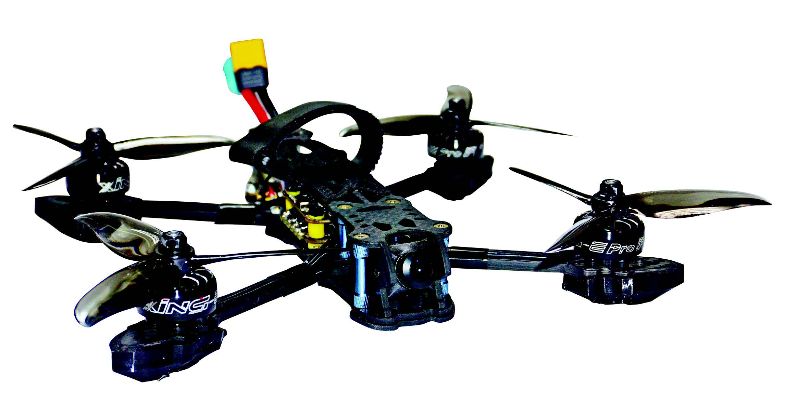
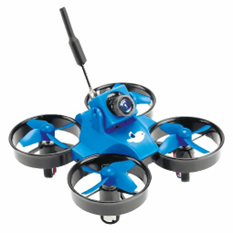
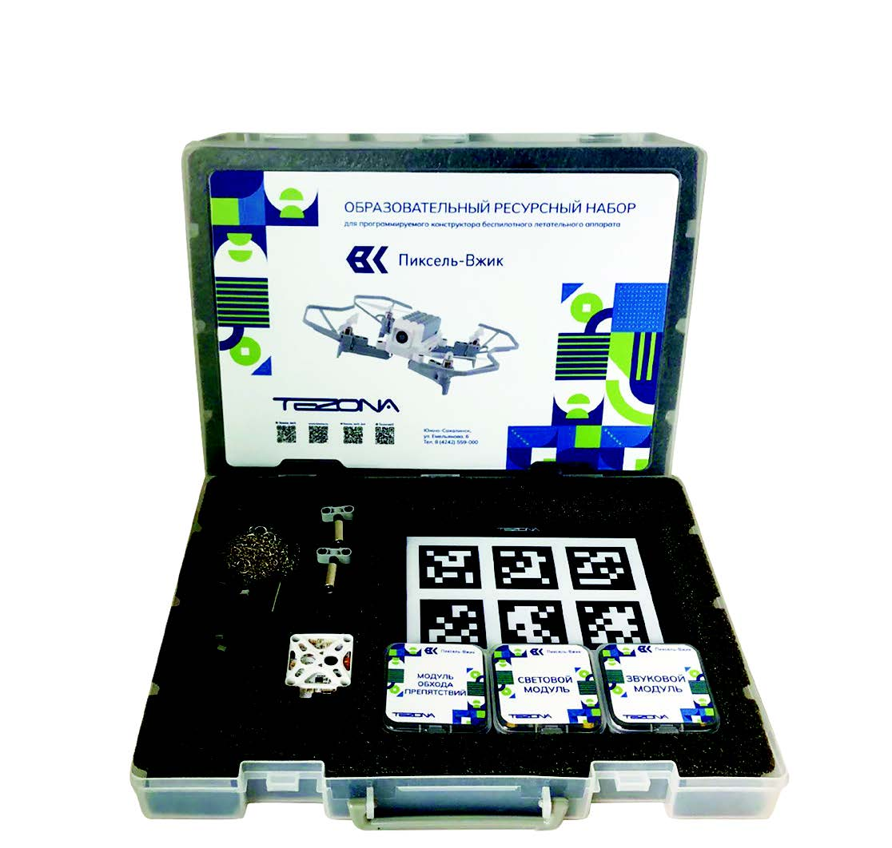

# Конструкторы, развивающие и ресурсные наборы

## Конструкторы

### Конструктор БПЛА «Пиксель-Вжик»

</img>

* [Инструкции и документация](assembly.md)

**Конструктор БПЛА «Пиксель-Вжик»** создан специально для обучения детей младшего и среднего школьного возраста. Он идеально подходит для введения в мир беспилотных летательных аппаратов и отработки практических навыков проектирования, программирования и моделирования дронов, а также знакомства с сопутствующими физическими процессами. Сделан из нетоксичного и безопасного ABS-пластика, простой в сборке и совместим с деталями конструктора "LEGO", что позволяет смоделировать и собрать квадрокоптер собственной конструкции.

### Конструктор БПЛА «Пиксель-Вжик - рой дронов»

</img>

* [Инструкции и документация](assembly.md)

**Конструктор БПЛА «Пиксель-Вжик - рой дронов»** состоит из 10 дронов и предназначен для детей от 6 до 14 лет. С помощью конструктора вы сможете одновременно управлять этими дронами путем программирования и создавать творческие решения для них. Конструктор дает возможность индивидуального программирования, программирования светового шоу и поддержку графического программирования. Кроме самого дрона и его комплектующих, в комплект входят: роутер, карта меток, транспортировочный кейс.

### Конструктор БПЛА мультироторного типа «Оса»

</img>

* [Инструкции и документация](assembly.md)

**Конструктор БПЛА мультироторного типа «Оса»** предназначен для изучения конструкции беспилотных летательных аппаратов мультироторного типа, их проектирования, сборки, обучения основам визуального пилотирования, пилотирования в полуавтономном и полностью автономном режимах и основам программирования с использованием различного набора датчиков.

В комплектацию конструктора входят все необходимые комплектующие для сборки БПЛА, а также система радиоуправления и передачи видеосигнала, что позволяет собрать полностью готовый беспилотный летательный аппарат.

В стандартной комплектации конструктор имеет систему круговой защиты, что позволяет использовать его в закрытых помещениях.

### Конструктор БПЛА самолетного типа «Орленок»

</img>

* [Инструкции и документация](assembly.md)

**Конструктор БПЛА самолетного типа «Орленок"** предназначен для изучения конструкции, ее проектирования, сборки, обучения основам визуального пилотирования, пилотирования в полуавтономном и полностью автономном режимах и основам программирования с использованием различного набора датчиков.

В комплектацию конструктора входят все необходимые комплектующие для сборки, а также система радиоуправления и передачи видеосигнала, что позволяет собрать полностью готовый беспилотный летательный аппарат.

### Конструктор спортивного БПЛА мультироторного типа для FPV-пилотирования «Олимпиец»

</img>

* [Инструкции и документация](assembly.md)

**Конструктор спортивного БПЛА мультироторного типа для FPV-пилотирования «Олимпиец»** предназначен для развития ранней профориентации в области конструирования, сборки и FPV пилотирования беспилотных летательных аппаратов мультироторного типа в общеобразовательных организациях для детей от 12 лет. 

Использование дрона «Олимпиец» в образовательном процессе позволит развить навыки FPV пилотирования дронов у учащихся и обеспечит возможность подготовки к участию в Дрон-рейсинге - виде соревновательной деятельности, представляющий собой гоночные соревнования квадрокоптеров (дронов), управляемых спортсменами-участниками соревнования, проводимые на специально оборудованных трассах.

Дрон «Олимпиец» позволяет развивать навыки конструирования и моделирования БПЛА. Тип конструктора: сборно-разборная модель, модульная многоразовая сборка.

## Развивающие и ресурсные наборы

### Развивающий набор для FPV-пилотирования «Чижик»

</img>

* [Инструкции и документация](assembly.md)

**Развивающий набор для FPV-пилотирования «Чижик»** предназначен для обучения FPV-пилотированию. Набор развивает навыки FPV-пилотирования. 3-х скоростной режим позволяет начинать обучение на низкой скорости без использования FPV-шлема (визуальное управление БПЛА) и впоследствии, приобретая опыт, увеличивать до максимальной с использованием FPV-шлема.

Данный БПЛА имеет небольшие размеры, поэтому его разрешается использовать внутри помещений. Набор предназначен для детей от 8 лет.

### Образовательный ресурсный набор для программирования конструктора БПЛА «Пиксель-Вжик»

</img>

* [Инструкции и документация](assembly.md)

**Образовательный ресурсный набор для программирования конструктора БПЛА «Пиксель-Вжик»** представляет собой комплект различных ЛЕГО-совместимых модулей для получения опыта программирования, развития творческих способностей и логического мышления обучающихся, для подготовки к участию в конкурсах и соревнованиях. Набор является необходимым дополнением к конструктору беспилотного летательного аппарата «Пиксель-Вжик».
