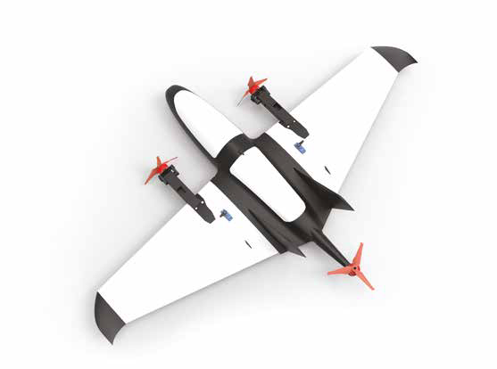

# Конструкторы

## Конструктор БПЛА мультироторного типа «проектная деятельность»

</img>

**Конструктор беспилотного летательного аппарата (БПЛА) мультироторного типа «проектная деятельность»** предназначен для изучения конструкции беспилотных летательных аппаратов мультироторного типа, их проектирования, сборки, обучения основам визуального пилотирования, пилотирования в полуавтономном и полностью автономном режимах и основам программирования с использованием различного набора датчиков.

В комплектацию конструктора входят все необходимые комплектующие для сборки беспилотного воздушного судна (далее БВС), а также система радиоуправления и передачи видеосигнала, что позволяет собрать полностью готовый беспилотный летательный аппарат.

В стандартной комплектации конструктор имеет систему круговой защиты, что позволяет использовать его в закрытых помещениях.

## Дрон 2

</img>

## Пиксель-Вжик
