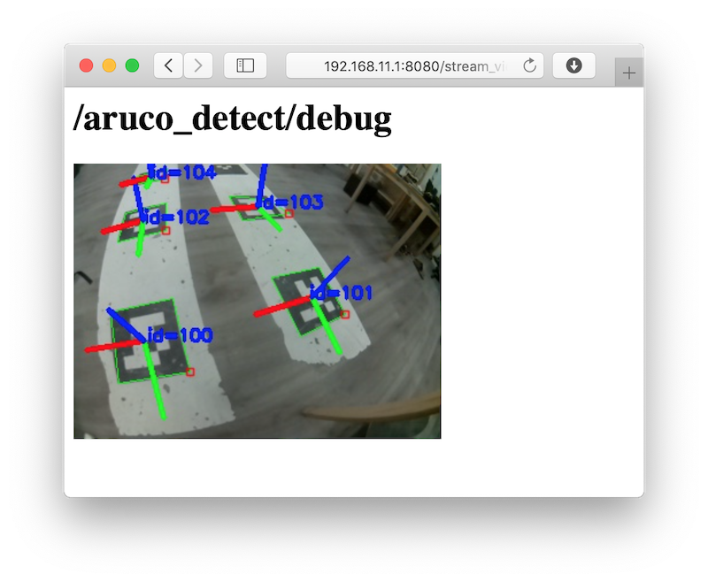

# Распознавание ArUco-маркеров

> **Note** Документация для версий [образа](image.md), начиная с версии **0.22**. Для более ранних версий см. [документацию для версии **0.20**](https://github.com/CopterExpress/clover/blob/v0.20/docs/ru/aruco_marker.md).

<!-- -->

> **Info** Для распознавания маркеров модуль камеры должен быть корректно подключен и [сконфигурирован](camera_setup.md).

Модуль `aruco_detect` распознает ArUco-маркеры и публикует их позиции в ROS-топики и в [TF](frames.md).

Эта функция полезна для применения совместно с какой-либо системой позиционирования для дрона, такой как [GPS](gps.md), [Optical Flow](optical_flow.md), PX4Flow, визуальная одометрия, ультразвуковое ([Marvelmind](https://marvelmind.com)) или UWB-позиционирование ([Pozyx](https://www.pozyx.io)).

Также возможно применение совместно с [навигацией по карте маркеров](aruco_map.md).

## Настройка

Аргумент `aruco` в файле `~/catkin_ws/src/clover/clover/launch/clover.launch` должен быть в значении `true`: $\color{red}{\textsf{🔴директория}}$

```xml
<arg name="aruco" default="true"/>
```

Для включения распознавания маркеров аргумент `aruco_detect` в файле `~/catkin_ws/src/clover/clover/launch/aruco.launch` должен быть в значении `true`: $\color{red}{\textsf{🔴директория}}$

```xml
<arg name="aruco_detect" default="true"/>
```

Для правильной работы в этом же файле также должны быть выставлены аргументы:

```xml
<arg name="placement" default="floor"/> <!-- расположение маркеров, см. далее -->
<arg name="length" default="0.33"/>     <!-- размер маркеров в метрах (не включая белую рамку) -->
```

Значение аргумента `placement` следует выставлять следующим образом:

* если *все* маркеры наклеены на полу (земле), выставить значение `floor`;
* если *все* маркеры наклеены на потолке, выставить значение `ceiling`;
* в противном случае удалить строку с параметром.

Если некоторые маркеры имеют размер, отличный значения `length`, их размер может быть переопределен с помощью параметра `length_override` ноды `aruco_detect`:

```xml
<param name="length_override/3" value="0.1"/>    <!-- маркер c id 3 имеет размер 10 см -->
<param name="length_override/17" value="0.25"/>  <!-- маркер c id 17 имеет размер 25 см -->
```

## Система координат

С маркером связана следующая система координат:

* ось **<font color=red>x</font>** указывает на правую сторону маркера;
* ось **<font color=green>y</font>** указывает кверху маркера;
* ось **<font color=blue>z</font>** указывает от плоскости маркера.


## Работа с распознанными маркерами

Наглядно распознанные маркеры можно видеть в топике `aruco_detect/debug`. Просмотреть его можно с помощью [`rqt_image_view`](rviz.md) или через [web_video_server](web_video_server.md) по ссылке http://192.168.11.1:8080/snapshot?topic=/aruco_pose/debug:



Распознанные маркеры и их позиции публикуются в топик `aruco_detect/markers`. Чтение топика из Bash:

```bash
rostopic echo /aruco_detect/markers
```

## Навигация по маркерам

С использованием модуля [`simple_offboard`](simple_offboard.md) можно осуществлять навигацию по маркерам используя соответствующие TF-фреймы.

Полет в точку над маркером 5 на высоту 1 метр:

```python
navigate(frame_id='aruco_5', x=0, y=0, z=1)
```

Полет в точку на метр левее маркера 7 на высоте 2 метра:

```python
navigate(frame_id='aruco_7', x=-1, y=0, z=2)
```

Если необходимый маркер не появится в поле зрения в течение полусекунды, дрон продолжит выполнять предыдущую команду.

Подобные значения `frame_id` можно использовать и в других сервисах, например `get_telemetry`. Получение расположения дрона относительно маркера 3:

```python
telem = get_telemetry(frame_id='aruco_3')
```

Если необходимый маркер не появится в поле зрения в течение полусекунды, в полях `telem.x`, `telem.y`, `telem.z`, `telem.yaw` будет значение `NaN`.

## Работа с результатом распознавания из Python

Чтение топика `aruco_detect/markers` из Python:

```python
import rospy
from aruco_pose.msg import MarkerArray
rospy.init_node('my_node')

# ...

def markers_callback(msg):
    print('Detected markers:'):
    for marker in msg.markers:
        print('Marker: %s' % marker)

# Подписываемся. При получении сообщения в топик aruco_detect/markers будет вызвана функция markers_callback.
rospy.Subscriber('aruco_detect/markers', MarkerArray, markers_callback)

# ...

rospy.spin()
```

Сообщения будут содержать ID маркера, его угловые точки на изображении и его позицию (относительно камеры).

---

См. далее: [навигация по картам маркеров](aruco_map.md).
