# Сборка Дрона 2

## Состав конструктора

<table class="type_table">
    <tr>
        <td>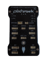</img></td>
        <td>x1</td>
        <td>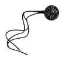</img></td>
        <td>x4</td>
        <td>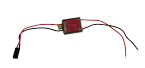</img></td>
        <td>x1</td>
        <td>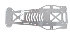</img></td>
        <td>x1</td>
    </tr>
    <tr>
        <td></img></td>
        <td>x1</td>
        <td>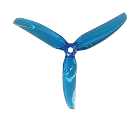</img></td>
        <td>x8</td>
        <td>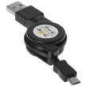</img></td>
        <td>x1</td>
        <td>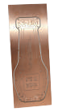</img></td>
        <td>x1</td>
    </tr>
    <tr>
        <td>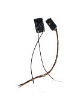</img></td>
        <td>x1</td>
        <td>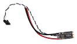</img></td>
        <td>x4</td>
        <td>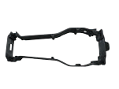</img></td>
        <td>x1</td>
        <td>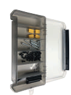</img></td>
        <td>x1</td>
    </tr>
    <tr>
        <td>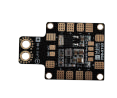</img></td>
        <td>x1</td>
        <td>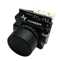</img></td>
        <td>x1</td>
        <td>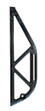</img></td>
        <td>x2</td>
        <td>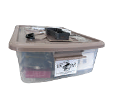</img></td>
        <td>x1</td>
    </tr>
    <tr>
        <td>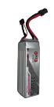</img></td>
        <td>x1</td>
        <td>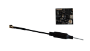</img></td>
        <td>x1</td>
        <td>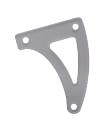</img></td>
        <td>x4</td>
        <td>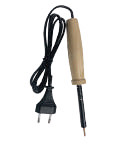</img></td>
        <td>x1</td>
    </tr>
    <tr>
        <td>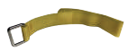</img></td>
        <td>x1</td>
        <td>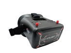</img></td>
        <td>x1</td>
        <td>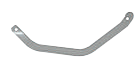</img></td>
        <td>x4</td>
        <td>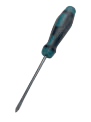</img></td>
        <td>x1</td>
    </tr>
    <tr>
        <td>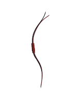</img></td>
        <td>x1</td>
        <td>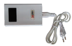</img></td>
        <td>x1</td>
        <td>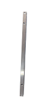</img></td>
        <td>x2</td>
        <td>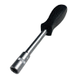</img></td>
        <td>x1</td>
    </tr>
    <tr>
        <td>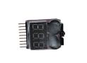</img></td>
        <td>x1</td>
        <td></img></td>
        <td>x1</td>
        <td>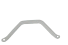</img></td>
        <td>x4</td>
        <td>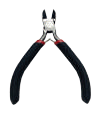</img></td>
        <td>x1</td>
    </tr>
    <tr>
        <td>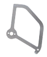</img></td>
        <td>x4</td>
    </tr>
</table>

## Подготовка платы распределения питания

1. Подготавливаем нижнюю деку к размещению на ней электронных компонентов - бокорезами удаляем перегородки и освобождаем плату.

    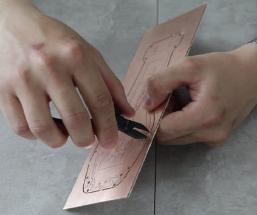</img>

2. С помощью паяльника и припоя (оловянная проволока с канифолью) залуживаем места для припайки проводов для аккумуляторов **A** и регуляторов оборотов **Р**.

    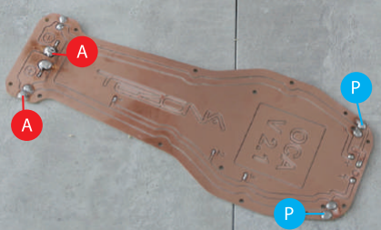</img>

    > **Внимание** Вырезы в корпусе должны быть в нижней части в районе пайки проводов регуляторов оборотов.

    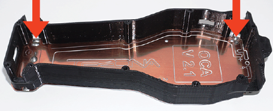</img>

3. Припаиваем провода к коннектору XT60, на котором указаны:

    **+** (красный провод)
    **-** (черный провод).

    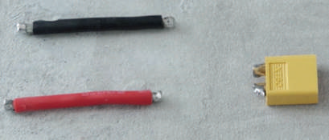</img>

4. Для изоляции контактов надеваем на места пайки термоусаживающую трубку и обрабатываем феном.

    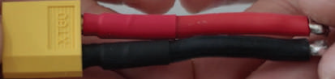</img>

5. Припаиваем коннектор к плате.

    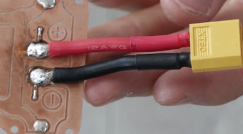</img>

6. Берем преобразователь напряжения BEC.

    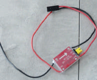</img>

7. Удаляем черный провод.

    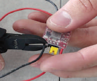</img>

8. Укорачиваем провода на 2 см.

    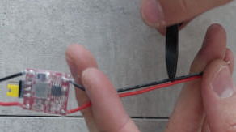</img>

    **Полетный контроллер готов**

    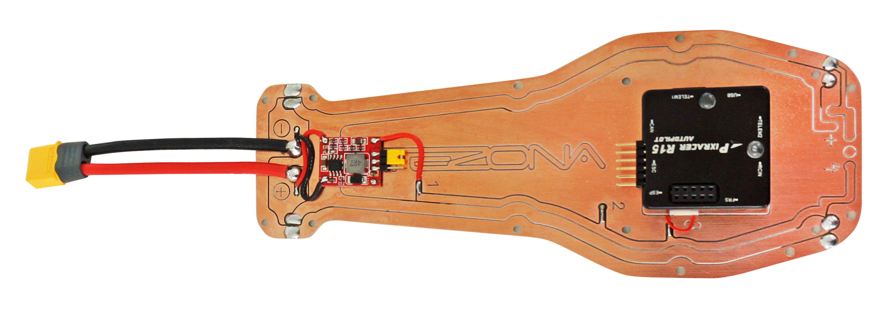</img>

9. Удлиняем сигнальный провод регулятора оборотов.

    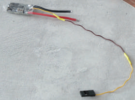</img>

10. Припаиваем все 4 регулятора оборотов к плате.

    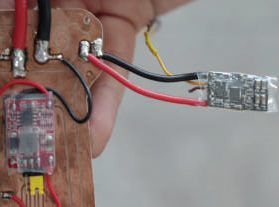</img>

11. Вставляем кабель в этот разъем контроллера.

    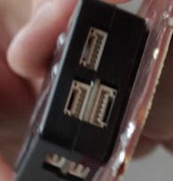</img>

12. Находим в комплекте полётного контроллера такой кабель.

    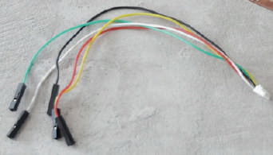</img>

13. Отрезаем коннекторы, спаиваем провода между собой в соответствии с цветом.

    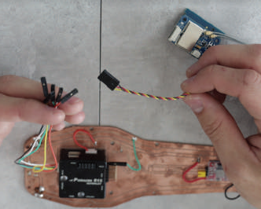</img>

14. Результат должен выглядеть так.

    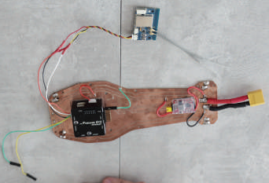</img>

## Связка приёмника с пультом управления

1. (15) Вставляем батарейки в отсек пульта управления.

2. (16) Включаем пульт (слева внизу черная кнопка).

3. (17) Удерживая кнопку, перемещаем этот ползунок вверх.

    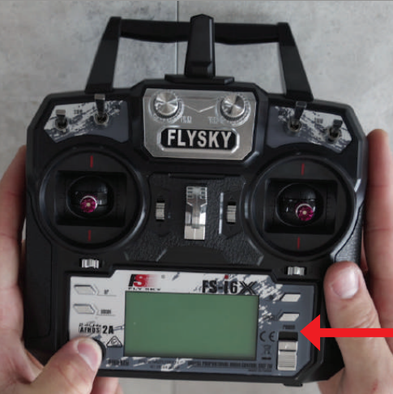</img>

4. (18) Автоматически на дисплее выдаётся сообщение об ошибке - это нормально!.

    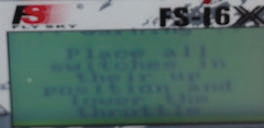</img>

5. (19) Сбрасываем ошибки движением правого стика вниз.

    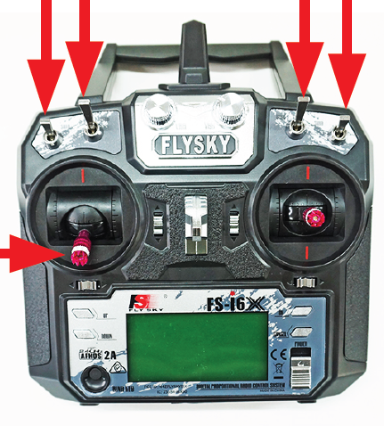</img>

6. (20) RX Binding... - ошибки удалены, аппаратура готова к связи с приёмником (Bind).

    </img>

7. (21) Находим на приемнике кнопку BND (крайняя).

    </img>

8. (22) Одновременно нажимаем на приемнике кнопку BND и присоединяем аккумулятор.

    </img>

9. (23) Постоянно горит красный индикатор - показатель готовности.

    </img>

    **Показатель связанности - информация на дисплее пульта**

    </img>

## Подключение регуляторов оборотов к полётному контроллеру

> **Внимание** Строго соблюдаем очередность подключения, начиная с верхнего правого.

</img>

1. (24) Подключаем первый регулятор оборотов и далее по порядку.

    </img>

    **Итоговое подключение**

    </img>

## Подключение электромоторов к регулятору оборотов

1. (25) Подключаем.

    </img>

    </img>

2. (26) Проверяем порядок вращения моторов (снаружи внутрь).

    </img>

    В случае, если мотор вращается неправильно, перепаиваем средний контакт с любым крайним.

## Монтаж рамы

1. (27) Вставляем стяжку крепления аккумулятора в верхнюю раму в специальные пазы.

    </img>

2. (28) Вставляем и крепим аккумулятор на раме.

    </img>

3. (29) Вставляем 2 штуки алюминиевых рам более крупными отверстиями вниз к раме в двух местах.

    </img>

4. (30) Центруем вдоль оси рамы, накрываем поликарбонатной крышкой, крепим её к корпусу шурупами.

    </img>

5. (31) Крепим силовые элементы для аккуммулятора к верхней крышке, чтобы получилось так:

    </img>

    Вид с внутренней стороны:

    </img>

## Крепление рамы к плате распределения питания

1. (32) Прижимаем провода вдоль корпуса к центру рамы и наставляем сверху корпус, крепим его шурупами.

    </img>

2. (33) Предварительно вставляем коннектор аккумулятора в специальное отверстие в раме.

    </img>

## Крепление элементов защиты пропеллеров

1. (34) Совмещаем отверстия элементов защиты с отверстиями в алюминиевой раме.

    </img>

    > **Внимание** Правильное положение элементов защиты на раме.

    </img>

## Крепление двигателей к раме

1. (35) Винтами М3, входящими в комплект мотора и шестигранником крепим мотор со стороны узких отверстий с нижней стороны рамы.

    </img>

    > **Внимание** Правильное положение элементов защиты и моторов на раме.

    </img>

2. (36) Фиксируем регуляторы оборотов пластиковыми хомутами.

    </img>

3. (37) Удаляем бокорезами излишки хомутов.

    </img>

## Крепление ножек к раме

1. (38) Две ножки скрепляются между собой винтами М3*8 и самокрутящимися гайками М3 с фторопластовой вставкой с помощью специального инструмента с головкой 5.5мм.

    </img>

    </img>

    Две ножки закреплены на раме.

    </img>

    > **Внимание** Указанные операции выполняются со всеми 4 лучами.

## Монтаж защиты пропеллеров

1. (39) Крепим стойки М3*40 к крайним частям элементов защиты корпуса с помощью шурупов и крестовой отвертки или шуруповерта.

    </img>

    </img>

2. (40) Теми же крепёжными элементами и инструментами крепим средние части защиты корпуса.

    </img>

## Монтаж второго уровня защиты пропеллеров

1. (41) Монтируем элементы защиты пропеллеров.

    </img>

    Так должно получиться:

    </img>

## Калибровка контроллера

1. (42) С помощью кабеля **micro USB - USB** подключаем компьютер к полетному контроллеру и калибруем его.

    </img>

    > **Внимание** Отверстия в корпусе для подключения к полётному контроллеру:

    </img>

## Установка пропеллеров

1. (43) Устанавливаем пропеллеры, соблюдая угол атаки по диагонали.

    </img>

2. (44) Закручиваем гайки на пропеллерах с помощью специального инструмента.

    </img>

## Установка аккумулятора

1. (45) Устанавливаем аккумулятор, крепим его стяжкой-липучкой, соединяем коннекторы.

    </img>

## Квадрокоптер готов к полёту
