# Конструктора БПЛА самолетного типа «Орленок»

## Документация

* [Технический паспорт](https://www.tezona.ru/data/uploads/files/tehpasport__orlenok.pdf)
* [STL файлы](https://www.tezona.ru/data/uploads/files/stl_orlenok.zip)
* [Инструкция по сборке PDF](https://www.tezona.ru/data/uploads/files/orlenok_instruktsiya_po_sborke_korpusa.pdf)
* [Видеоинструкция сборки часть 1](https://www.tezona.ru/data/uploads/files/Orlenok-instrukcia-1.webm)
* [Видеоинструкция сборки часть 2](https://www.tezona.ru/data/uploads/files/Orlenok-podkluchenie-i-nastroika.mp4)
* [Видеоинструкция прошивки полетного контроллера](https://www.tezona.ru/data/uploads/files/Orlenok-nastroika-pc.mp4)

## Сборка фюзеляжа

### Вставляем переднюю деку в переднюю часть фюзеляжа с помощью 4-х винтов М3*8

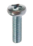

Передняя дека:

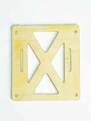

Передняя часть фюзеляжа:

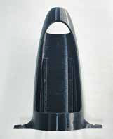

Готово:

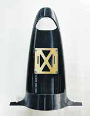

### Вставляем заднюю деку в заднюю часть фюзеляжа

Задняя дека:

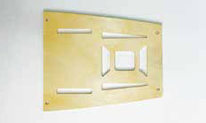

Задняя часть фюзеляжа:

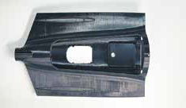

Готово:

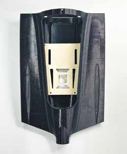

### Соединяем переднюю и заднюю часть фюзеляжа с помощью 2-х винтов M3*8

Передняя часть фюзеляжа:

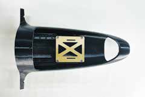

Задняя часть фюзеляжа:

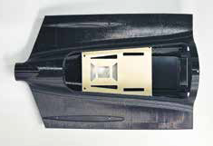

Готово:

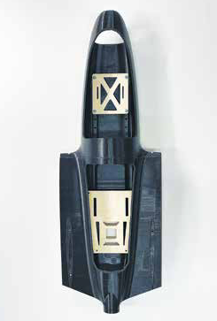

### Присоединяем хвостик к задней части фюзеляжа с двух сторон винтами M3*8

Хвостовик:

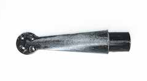

Готово:

## Установка килей

### Берем левый и правый киль, вставляем их в пазы фюзеляжа, прикручиваем каждый двумя винтами M3*20

Левый киль:

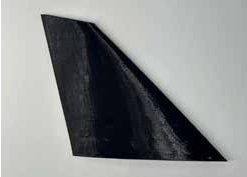

Правый киль:

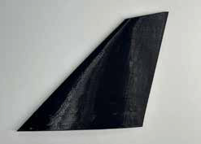

Место установки:

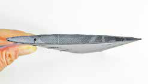
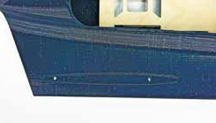

Готово:

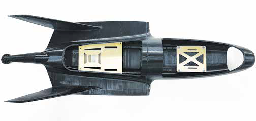

## Установка носовой части фюзеляжа

### Прикручиваем носовую крышку к фюзеляжу 2 винтами M3*8

Носовая крышка:

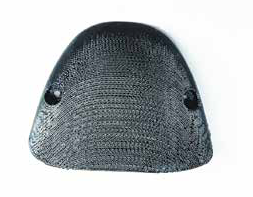

Место установки:

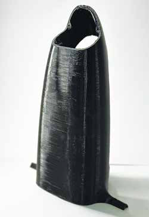

Результат:

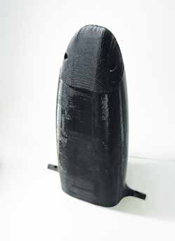

## Установка защелки для крышки

### Прикручиваем защелки к фюзеляжу каждую винтом М3х8

 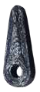

Передняя часть фюзеляжа:

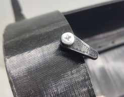

Задняя часть фюзеляжа:

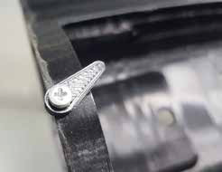

Результат:

## Сборка крыльев

### Усиливаем жесткость крыла путём вставки 3-х карбоновых прутков в каждое крыло. Выполняем надрез глубиной 5 мм по размерам чертежа в нижней и верхней сторонах крыла

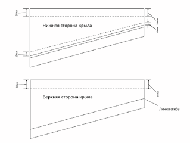

### Отрезаем пруток по длине крыла

Выполняем надрез на нижней стороне крыла, отступив от линии сгиба 15 мм, глубиной не более 5 мм:

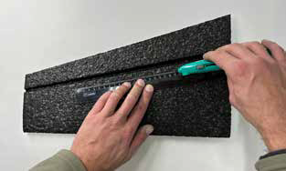

Выполняем надрез на нижней стороне крыла, отступив от переднего края крыла 30 мм, глубиной не более 5 мм:

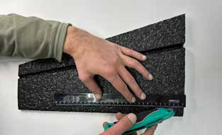

Выполняем надрез и вставляем пруток на верхней стороне крыла, отступив от переднего края крыла 30 мм, глубиной не более 5 мм. Вставляем в прорези крыла прутки до полного погружения в крыло:

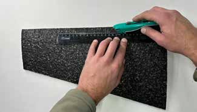

### Усиливаем жесткость крыла путём наклейки плёнки ламинированной на каждое крыло. Используем: 2 крыла, плёнку ламинированную, утюг

Накладываем плёнку на крыло матовой частью внутрь с запасом по краям:

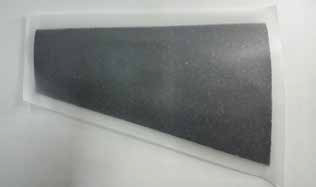

Нагреваем утюг до максимального состояния и движениями от центра к краю крыла разглаживаем плёнку, слегка прижимая. Плёнка должна приклеиться к крылу:

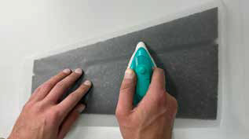

### Формируем на крыле посадочное место для сервомотора. Используем: канцелярский нож, клей Akfix или супер клей

Согласно схеме. Отступаем от края 90 мм, от стыковочного 15 мм. Вырезаем прямоугольник из пленки 25*35 мм:

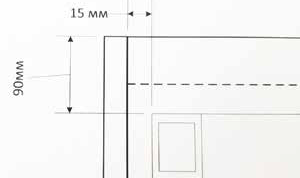

Приклеиваем клеем к посадочному месту рамку сервопривода:

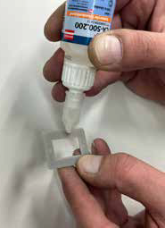

По внутреннему краю рамки вырезаем прямоугольное отверстие - глубиной 20 мм для сервомотора:

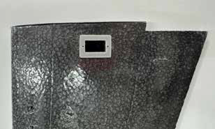

### Приклеиваем стыковую нервюру к внутренней стороне крыла. Используем: клей Akfix или супер клей, дрель, сверло 10 мм

Приклеиваем стыковую нервюру к внутренней стороне крыла:

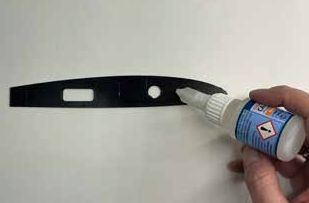

Делаем отверстие диаметром 10 мм и глубиной 130-150 мм для вставки в него силового элемента корпуса (круглый алюминиевый профиль):

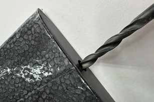

Укорачиваем элерон с внутренней части на каждом крыле:

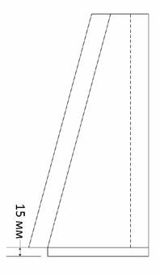

Результат:

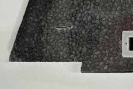

### Устанавливаем крепление для поворотной системы на крыло. Используем: крепление для поворотной системы, 4 винта М3х20, 4 гайки М3, дрель, сверло 3 мм

Крепление для поворотной системы:

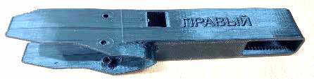

С помощью линейки, отступаем от края 90 мм:

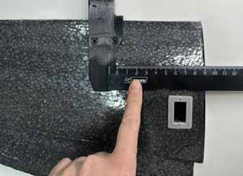

Устанавливаем крепление для поворотной системы:

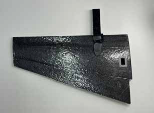

> **Внимание** Крепление для поворотной системы бывают левые и правые, не путать!

### Формируем трассу в крыле для кабелей от сервомотора и электромотора. Используем: канцелярский нож

Прорезаем ножом углубление в крыле приблизительно на 7 мм:

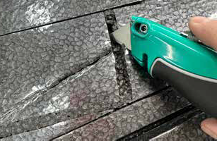

### Приклеиваем законцовки крыльев к крыльям. Используем: левую и правую законцовки крыла, 2 крыла, клей Арфикс или супер клей

Приклеиваем левую законцовку крыла к левому крылу изгибом вверх:

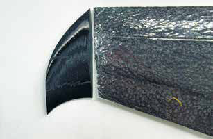

Клей наносим на торец законцовки сплошной линией:

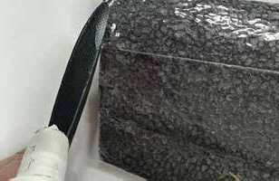

Приклеиваем правую законцовку крыла к правому крылу изгибом вверх:

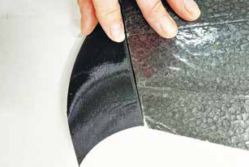

Левое крыло – это то, которое находится слева вдоль фюзеляжа, расположенного крышками сверху и носовой частью от себя. Правое крыло - зеркально левому

> **Внимание** Законцовку не приклеивать к элерону!

### Устанавливаем «кабанчик» на крыло. Используем: элемент «кабанчик», канцелярский нож, клей Akfix или супер клей

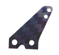

Согласно схеме отступает от края 30 мм, прорезаем углубление в крыле длиной 15 мм и вставляем «кабанчик» в него:

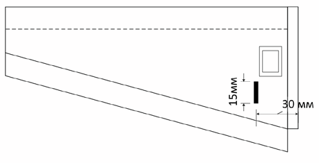

По краям «кабанчика» пропитываем клеем:

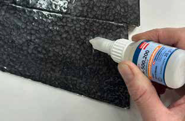

Результат: «кабанчик» вклеен в крыло:

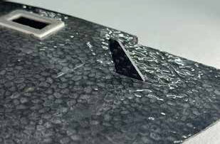

## Сборка частей корпуса

### Сборка корпуса

Используем: левое и правое крыло, собранный фюзеляж, силовой элемент корпуса (круглая алюминиевая труба):

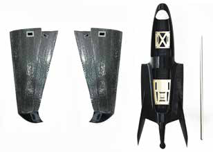

Вставляем трубу в отверстие корпуса так, чтобы левая и правая части оказалась равны:

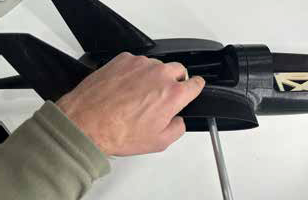

Вставляем трубу в левое и правое крыло до упора - крыло должно «сесть» в своё посадочное место в фюзеляже:

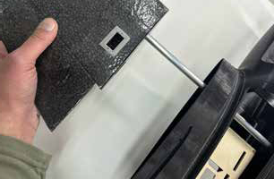

### Сборка крышек

Вставляем выступ задней крышки в фюзеляж, прижимаем к нему и фиксируем защёлкой. Вставляем выступ передней крышки в переднюю часть фюзеляжа, прижимаем к нему и фиксируем защёлкой:

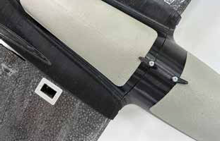

Собранный вид:

## Подключение и настройка

* [Видеоинструкция подключения и настройки](https://www.tezona.ru/data/uploads/files/Orlenok-podkluchenie-i-nastroika.webm)
