# Конструктор БПЛА «Пиксель-Вжик» и «Пиксель-Вжик - рой дронов»

* [Программное обеспечение](https://www.tezona.ru/download/avia-application/)
* [Драйверы для Win 8 or 10](https://www.tezona.ru/data/uploads/files/driver_for_win_8_or_10.zip)
* [Драйверы для Win 7](https://www.tezona.ru/data/uploads/files/driver_for_win_7.zip)
* [Драйверы для Mac](https://www.tezona.ru/data/uploads/files/mac_osx_vcp_driver.zip)

1. [Перейти к «Пиксель-Вжик»](#title1)
2. [Перейти к «Пиксель-Вжик - рой дронов»](#title2)

## <a id="title1">«Пиксель-Вжик»</a>

* [Инструкция по сборке PDF](https://www.tezona.ru/data/uploads/files/piksel-vzhik_instruktsiya.pdf)

### Зарядка аккумулятора

Вставьте аккумулятор в зарядное устройство, как показано на рисунке. Используйте кабель micro USB для зарядки (макс. входное напряжение 8,4 В, 600 мАч):

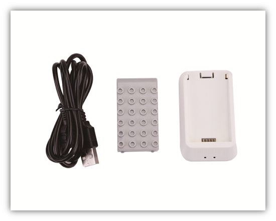
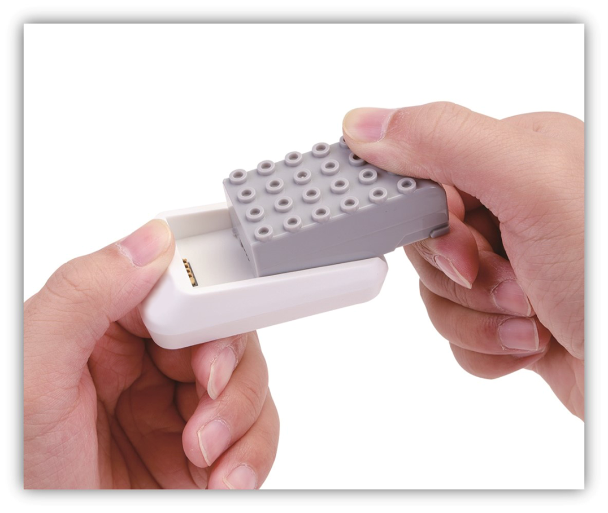
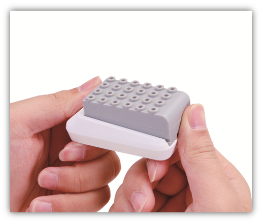
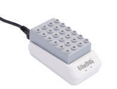

Постоянный красный цвет индикатора указывает на состояние зарядки аккумулятора:

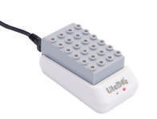

Постоянный зеленый цвет индикатора указывает на полную зарядку аккумулятора (может занять до 1 часа):

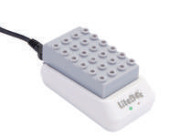

> **Внимание** Не заряжайте аккумулятор через порт USB на дроне.

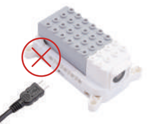

### Сборка дрона

Установите крепежные элементы в центральную деку дрона:

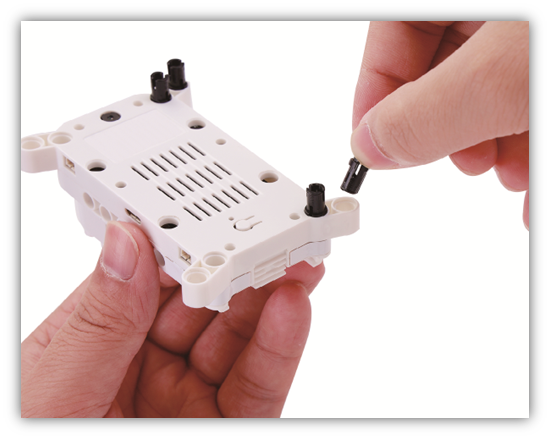

Установите лучи дрона:

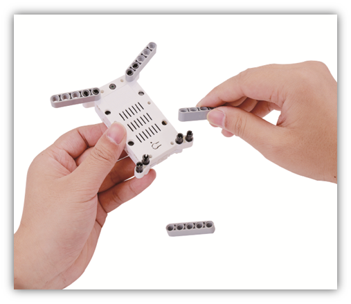

Установите крепежные элементы в мотораму:

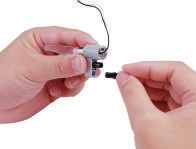

Установите мотораму:

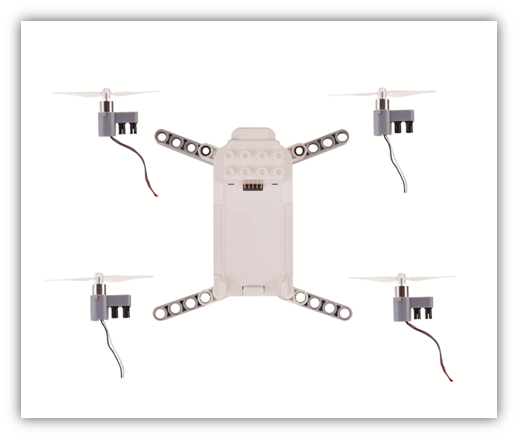

> **Внимание** Установите моторы с пропеллерами в строго определенном порядке. Двигатели вращения CW(по часовой стрелке) установите на ЛЕВЫЙ ВЕРХНИЙ и ПРАВЫЙ НИЖНИЙ лучи дрона, а CCW(против часовой стрелки) на ПРАВЫЙ ВЕРХНИЙ и ЛЕВЫЙ НИЖНИЙ.

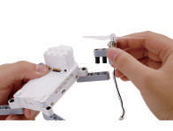
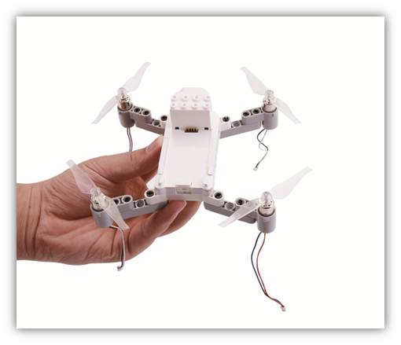
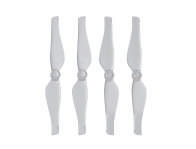

Установите крепление винтомоторной группы:

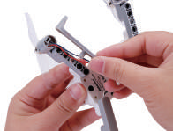
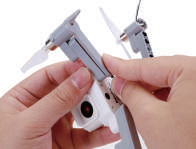

Установите защиту пропеллеров:

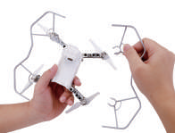
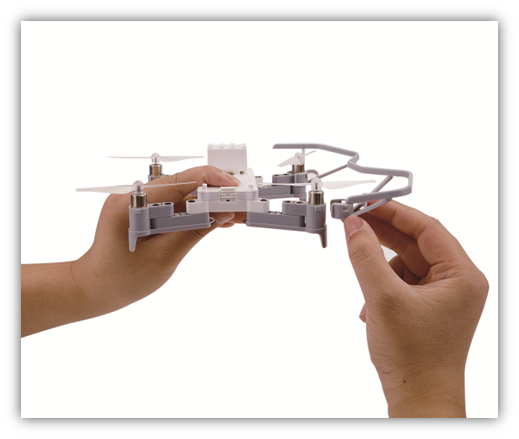

Установите аккумулятор:

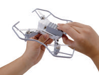

## Подключение аппаратуры управления

Установите 3x AAA аккумулятора:

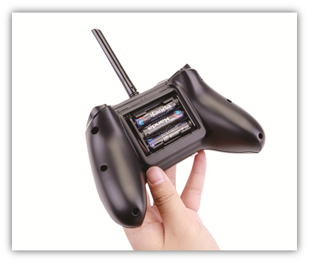

Включите аппаратуру управления:

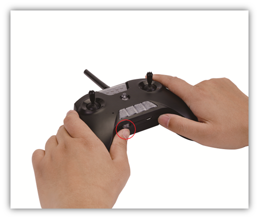

При первой эксплуатации Вам необходимо будет связать аппаратуру управления с приемником на борту дрона, для этого войдите в режим привязки, нажав K0 (средняя кнопка), удерживая правый стик в направлении правого верхнего угла. При удачной связки аппаратуры управления с дроном, у Вас загорятся два зеленых светодиода , как показано на рисунке:

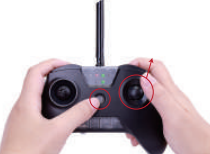

Нет связи:

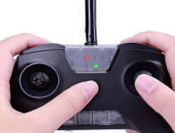

Связан:

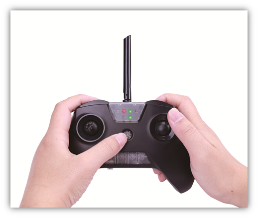

> **Внимание** Для удачного подключения аппаратуры управление, необходимо включить
дрон, режим поиска аппаратуры управления включится автоматически.

## Включение и поиск аппаратуры управления

Чтобы включить дрон, нажмите и удерживайте кнопку питания в течение 1 секунды. Если у дрона отсутсвует связь с аппаратурой управления светодиод будет мигать красным цветом:

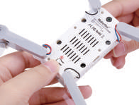

Постоянный зеленый цвет светодиода указывает на успешное соедениние дрона с аппаратурой управления:

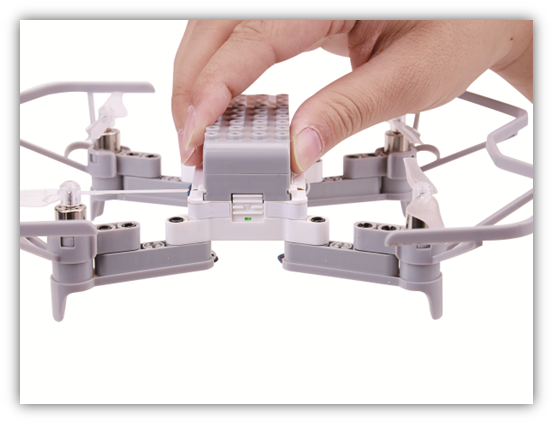

## Первый взлет

Существует два режима управления Mode 1 и Mode 2 Управление по умолчанию находится в режиме Mode 2. Вы может переключать управление в любой режим. Разница между этими режимами заключается в том, каким стиком осуществляется управление дроном:

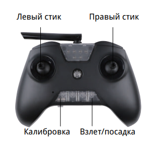

Mode 1:

Mode 2:

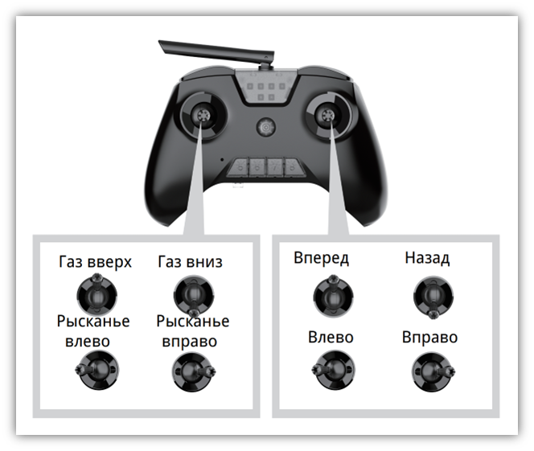

Поставьте дрон на ровную поверхность камерой от себя.

Нажмите кнопку «Калибровка» один раз и откалибруйте аппаратуру управления:

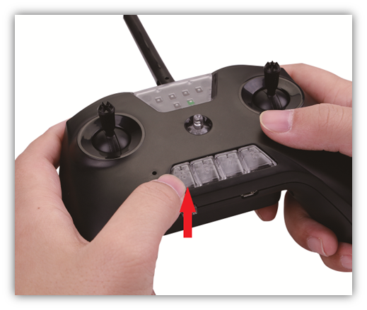

Нажмите кнпоку «Взлет/Посадка» один раз. Дрон должен взлететь.

Используйте правый стик для управления дроном вперед/назад и движение влево/вправо.

Используйте левый джойстик для управления высотой и направлением дрона вокруг своей оси.

Нажмите кнопку взлета/посадки еще раз, чтобы посадить дрон.

## Программирование дрона с помощью компьютера

[Скачайте и установите программное обеспечение «Пиксель-Вжик».](https://www.tezona.ru/download/avia-application/)

Откройте программное обеспечение «Пиксель-Вжик». Нажмите «Добавить расширение»:

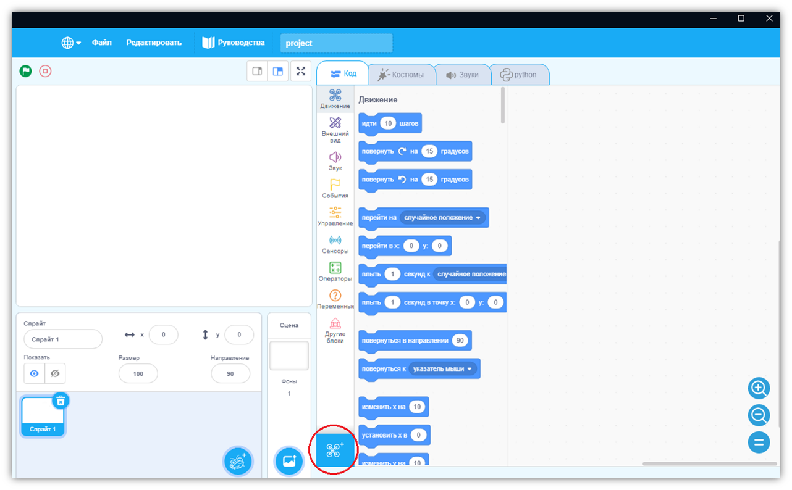

Выберите «Пиксель-Вжик»:

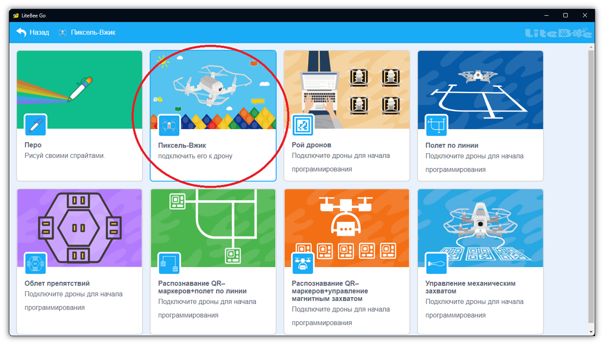

Откроется диалоговое окно, которое уточнит, подключена ли аппаратура управления:

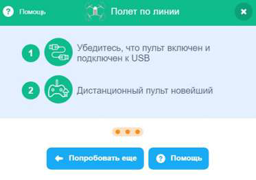

Соедините аппаратуру управления с компьютером через USB кабель, нажмите K0, чтобы перейти в режим программирования (постоянно горит зеленый цвет светодиода). Нажмите «Попробовать еще раз»:

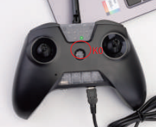

Scratch-программирование: нажмите **Код -> Файл -> Загрузить с компьютера**:

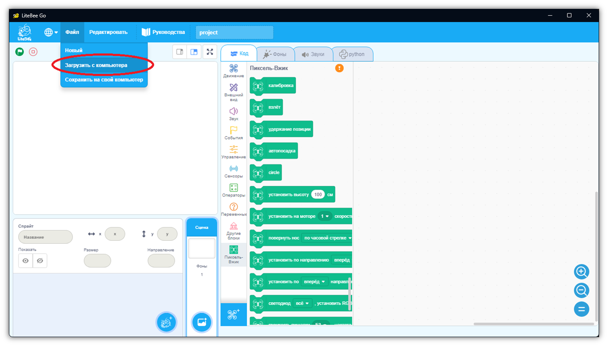

Поставьте дрон на ровную ровную поверхность камерой от себя. Чтобы запустить программу нажмите зеленый флажок в программном обеспечении LitebeeGo:

Как программировать на Python. Нажмите **Python -> Запуск -> Открыть** и откройте программу в формате **.py**:

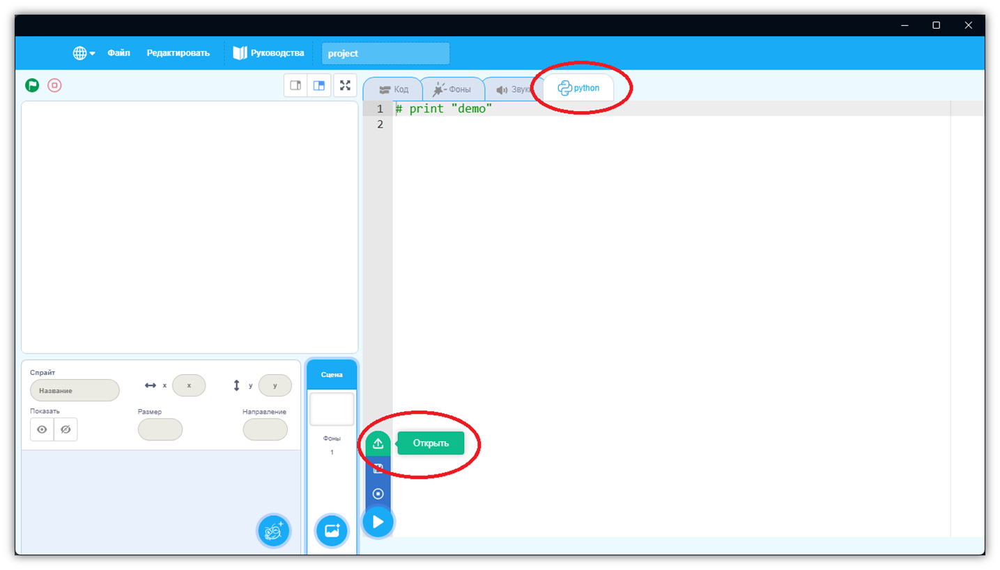

Поставьте дрон на ровную поверхность камерой от себя.

Чтобы запустить программу нажмите **Запуск**, дрон начнет выполнять программу.

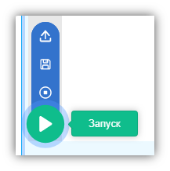

## Управление дроном с помощью мобильного приложения

Установите приложение LiteBee в Play Store:

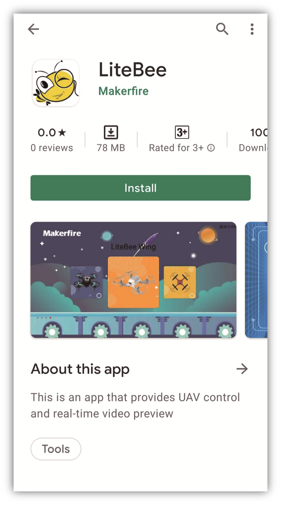

Включите и поставьте дрон на ровную повернхность камерой от себя.

Предоставьте разрешение на использование местоположения:

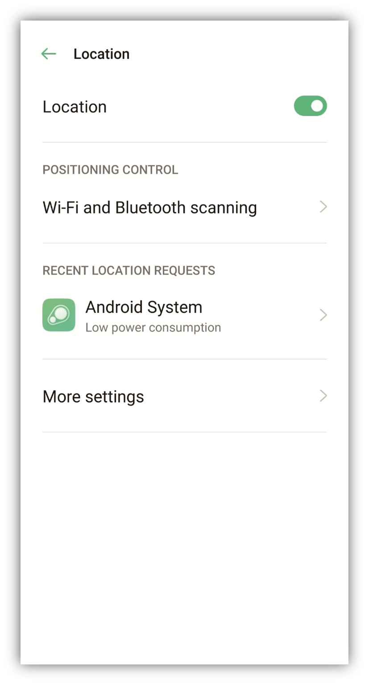

Зайдите в «Настройки» на телефоне и подключитесь к сети «Wi-Fi» дрона **Litebeewing_XXXX**, пароль: **12345678**:

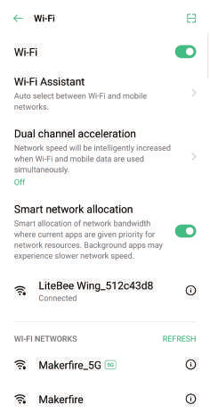

Зайдите в приложение Litebee и нажмите «Litebee wing»:

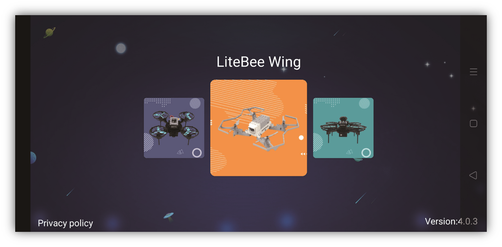

Предоставьте разрешение на хранение, если приложение спросит:

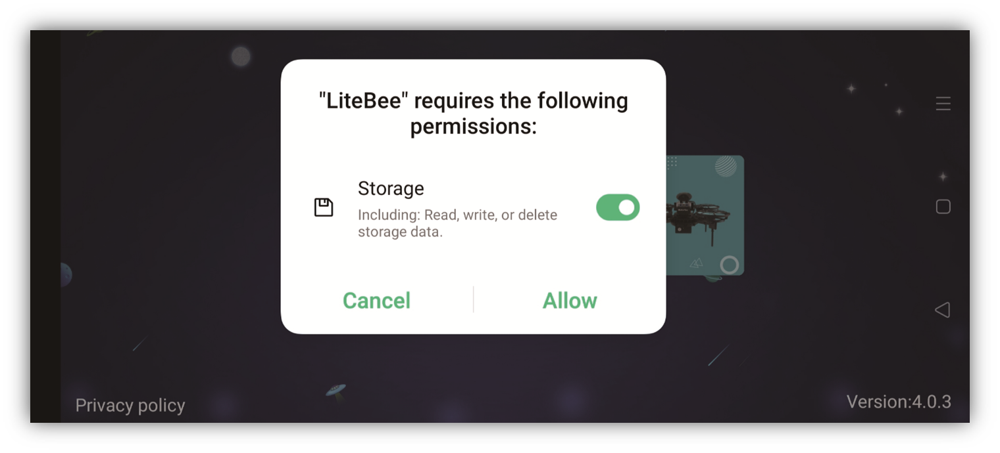

Выберите значок «Аппаратуры управления»:

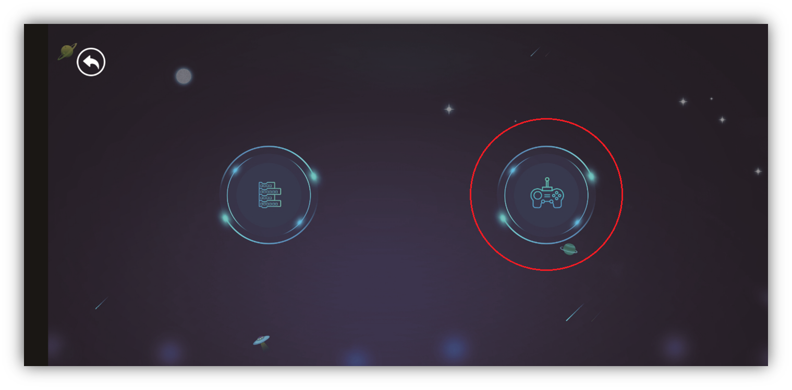

Щелкните значок «Калибровка»:

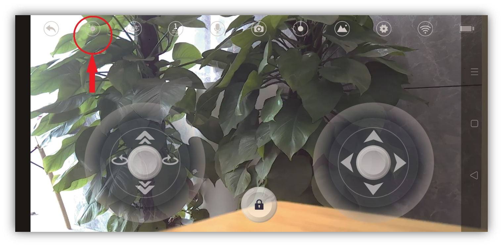

Нажмите значок «Блокировка» и сдвиньте ползунок вправо для разблокировки, после чего дрон взлетит автоматически:

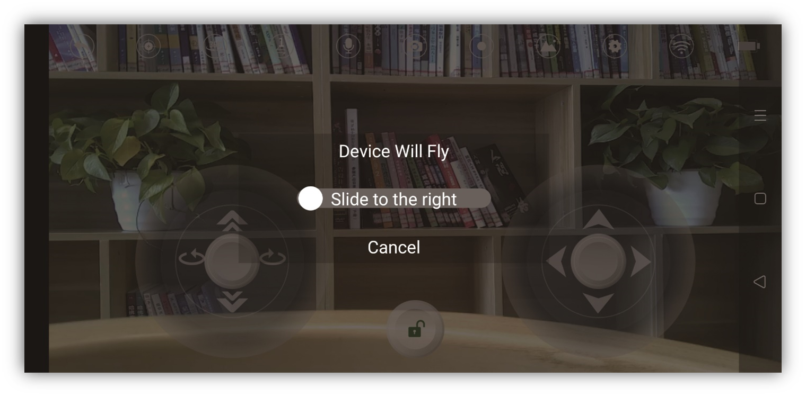

Нажмите значок «Заблокировать» еще раз, чтобы посадить дрон.

Функции:

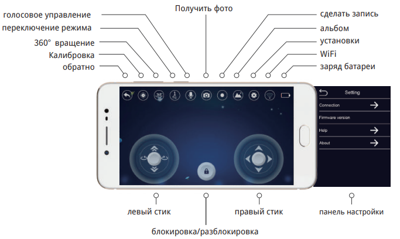

## Программирование дрона с помощью мобильного приложения

Выберите значок «Программирование» и перейдите к программированию:

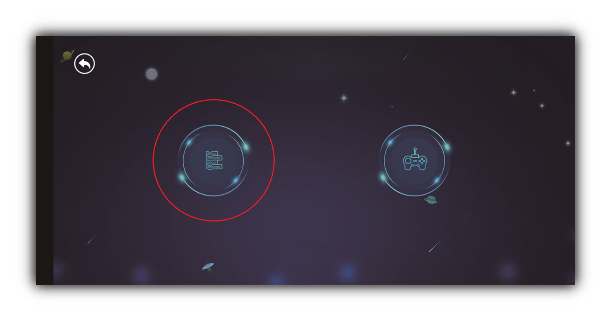

Обязательно добавляйте «Задержки 5 секунд» на каждом шаге. Нажмите значок «Воспроизвести» и дрон начнет выполнять написанную программу:

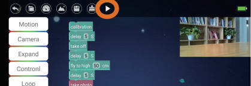

Сохранение программына телефоне:

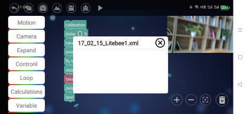

Функции программирования:

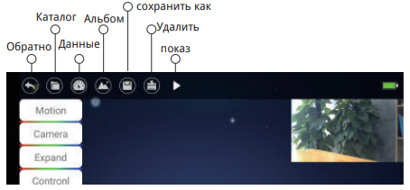

## <a id="title2">«Пиксель-Вжик» - рой дронов</a>

* [«Пиксель-Вжик - рой дронов» технический паспорт PDF](https://www.tezona.ru/data/uploads/files/tehnicheskiĭ_pasport_pikselvzhik-roĭdronov.pdf)
* [«Пиксель-Вжик - рой дронов» инструкция по эксплуатации PDF](https://www.tezona.ru/data/uploads/files/vzhik_manual_a5_print.pdf)

### Подготовка к полету

Вставьте аккумулятор:

Присоедините светодиодный модуль:

Вставьте блок питания роутера в розетку для подлключения дронов и компьютера:

### Установка программного обеспечения

[Скачайте и установите программное обеспечение.](https://www.tezona.ru/download/avia-application)

Ознакомьтесь с меню:

### Переключение в режим «рой дронов»

Нажмите **Добавить расширение**:

Выберите **Рой дронов**:

Подключитесь к роутеру:

> **Подсказка** Название сети - **Litebee_Fm**, пароль - **test1234**.

### Запуск полетной программы

Загрузите полетную программу из примеров:

Выберите, например, 8 дронов:

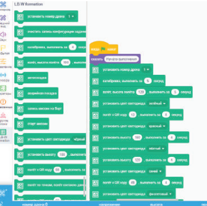

Расстелите карту меток на полу и расположите на ней дроны.

Для включения нажмите и удерживайте кнопку питания на корпусе дрона в течении 1-3 секунды:

Дрон будет подключен, когда его светодиод загорится **зеленым**.

Программа покажет блок **«номер дрона: 1»**. Цифра будет увеличиваться по мере подключения дронов:

Для определения номера дрона наведите указатель мыши на блок **«высота»** и поднимите дрон вверх. Строка, где будет изменяться значение - номер вашего дрона:

> **Подсказка** Левая часть подписи блока - это идентификатор дрона, а правая часть - значение.

Разместите дроны на карте меток. Возьмем, например, программу **8 дронов**:

> **Внимание** Места для взлета должны соответствовать программе. Цифы на карте меток - номер дрона.

### Тестирование полетной программы

Скомпилируйте программу, нажав на **зеленый флажок**:

Нажмите на кнопку в виде глаза, чтобы запустить симулятор:

Внутри симулятора подключитесь к программе:

Вернитесь на рабочее поле и запишите миссию на борт дрона:

В симуляторе нажмите на кнопку начала симуляции:

### Меры предосторожности/проблемы

### Порядок замены аккумулятора

### Полёт

