# Сборка Пиксель-Вжик

* [Инструкция по сборке PDF](https://www.tezona.ru/data/uploads/files/piksel-vzhik_instruktsiya.pdf)
* [Программное обеспечение](https://www.tezona.ru/download/avia-application/)
* [Драйверы для Win 8 or 10](https://www.tezona.ru/data/uploads/files/driver_for_win_8_or_10.zip)
* [Драйверы для Win 7](https://www.tezona.ru/data/uploads/files/driver_for_win_7.zip)
* [Драйверы для Mac](https://www.tezona.ru/data/uploads/files/mac_osx_vcp_driver.zip)
* [«Пиксель-Вжик - рой дронов» технический паспорт PDF](https://www.tezona.ru/data/uploads/files/tehnicheskiĭ_pasport_pikselvzhik-roĭdronov.pdf)
* [«Пиксель-Вжик - рой дронов» инструкция по эксплуатации PDF](https://www.tezona.ru/data/uploads/files/vzhik_manual_a5_print.pdf)

## Зарядка аккумулятора

1. (1) Вставьте аккумулятор в зарядное устройство, как показано на рисунке.
       Используйте кабель micro USB для зарядки (макс. входное напряжение 8,4 В, 600 мАч):

    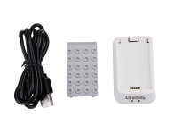</img>

2. (2)

    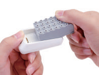</img>

3. (3)

    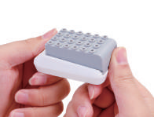</img>

4. (4)

    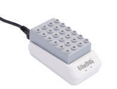</img>

5. (5) Постоянный красный цвет индикатора указывает
       на состояние зарядки аккумулятора:

    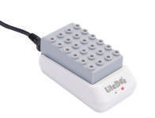</img>

6. (6) Постоянный зеленый цвет индикатора указывает
       на полную зарядку аккумулятора (может занять до 1 часа):

    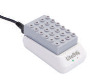</img>

    > **Внимание** Не заряжайте аккумулятор через порт USB на дроне.

    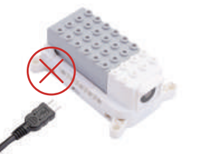</img>

## Сборка квадрокоптера

1. (7) Установите крепежные элементы в
       центральную деку квадрокоптера:

    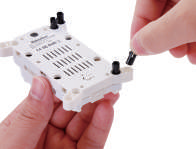</img>

2. (8) Установите лучи квадрокоптера:

    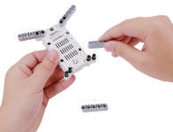</img>

3. (9) Установите крепежные элементы в мотораму:

    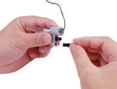</img>

4. (10) Установите мотораму:

    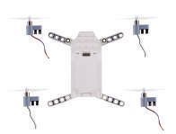</img>

    > **Внимание** Установите моторы с пропеллерами в строго определенном порядке.
Двигатели вращения CW(по часовой стрелке) установите на ЛЕВЫЙ ВЕРХНИЙ и ПРАВЫЙ НИЖНИЙ
лучи квадрокоптера, а CCW(против часовой стрелки) на ПРАВЫЙ ВЕРХНИЙ и ЛЕВЫЙ НИЖНИЙ.

5. (11)

    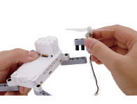</img>

6. (12)

    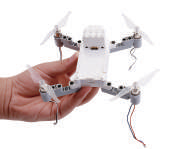</img>

7. (13)

    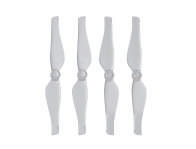</img>

8. (14) Установите крепление винтомоторной группы:

    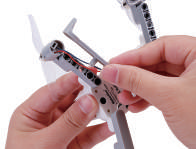</img>

9. (15)

    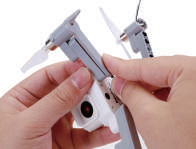</img>

10. (16) Установите защиту пропеллеров:

    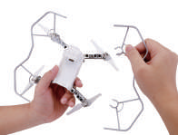</img>

11. (17)

    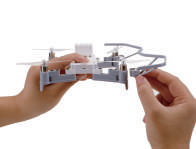</img>

12. (18) Установите аккумулятор:

    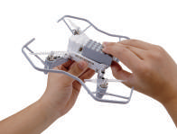</img>

## Подключение аппаратуры управления

1. (19) Установите 3x AAA аккумулятора:

    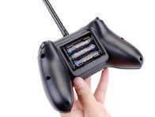</img>

2. (20) Включите аппаратуру управления:

    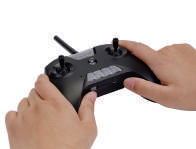</img>

3. (21) При первой эксплуатации Вам необходимо будет связать аппаратуру управления с
    приемником на борту квадрокоптера, для этого войдите в режим привязки, нажав K0
    (средняя кнопка), удерживая правый стик в направлении правого верхнего угла. При
    удачной связки аппаратуры управления с квадрокоптером, у Вас загорятся два
    зеленых светодиода , как показано на рисунке:

    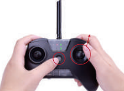</img>

    Нет связи:

    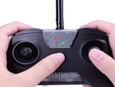</img>

    Связан:

    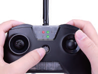</img>

    > **Внимание** Для удачного подключения аппаратуры управление, необходимо включить
квадрокоптер, режим поиска аппаратуры управления включится автоматически.

## Включение и поиск аппаратуры управления

1. (22) Чтобы включить квадрокоптер, нажмите и
    удерживайте кнопку питания в течение 1 секунды.
    Если у квадрокоптера отсутсвует связь с аппаратурой
    управления светодиод будет мигать красным цветом:

    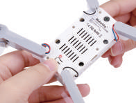</img>

2. (23) Постоянный зеленый цвет светодиода указывает на
    успешное соедениние квадрокоптера с аппаратурой управления:

    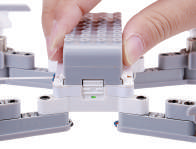</img>

## Первый взлет

1. (24) Существует два режима управления Mode 1 и Mode 2
    Управление по умолчанию находится в режиме Mode 2.
    Вы может переключать управление в любой режим.
    Разница между этими режимами заключается в том,
    каким стиком осуществляется управление квадрокоптером:

    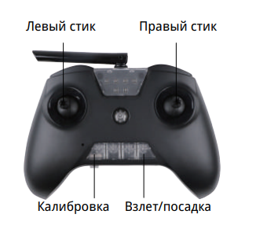</img>

    Mode 1:

    </img>

    Mode 2:

    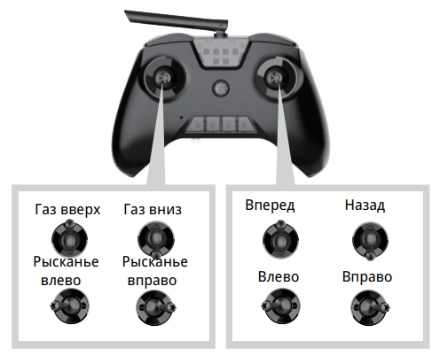</img>

2. (25) Поставьте квадрокоптер на ровную поверхность камерой от себя.

3. (26) Нажмите кнопку «Калибровка» один раз и откалибруйте аппаратуру управления:

    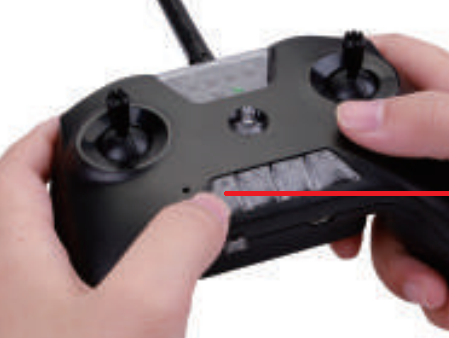</img>

4. (27) Нажмите кнпоку «Взлет/Посадка» один раз. Квадрокоптер должен взлететь.

    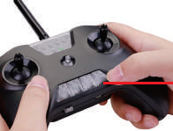</img>

5. (28) Используйте правый стик для управления квадрокоптером вперед/назад и движение влево/вправо.

6. (29) Используйте левый джойстик для управления высотой и направлением дрона вокруг своей оси.

7. (30) Нажмите кнопку взлета/посадки еще раз, чтобы посадить квадрокоптер.

## Программирование квадрокоптера с помощью компьютера

1. (31) [Скачайте и установите программное обеспечение «Пиксель-Вжик».](https://www.tezona.ru/download/avia-application/)

2. (32) Проверьте, корректно ли установлен драйвер на вашем компьютере.
    Пример: «Мой компьютер» — «Управление» — COM3 — означает что все корректно:

    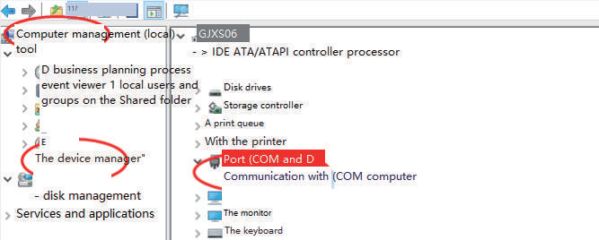</img>

3. (33) [Если нет COM-порта, значит драйвер не установлен. Загрузите и установите драйвер.](https://www.tezona.ru/download/avia-application/)

4. (34) Откройте программное обеспечение «Пиксель-Вжик». Нажмите «Добавить расширение»:

    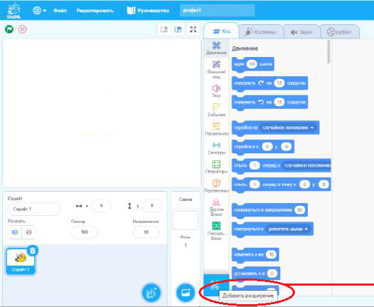</img>

5. (35) Выберите «Пиксель-Вжик»:

    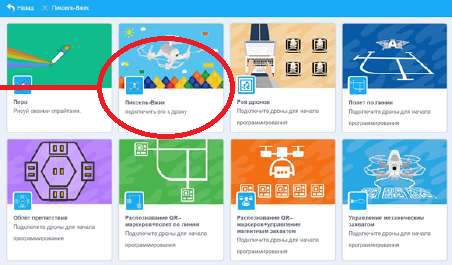</img>

6. (36) Откроется диалоговое окно, которое уточнит, подключена ли аппаратура управления:

    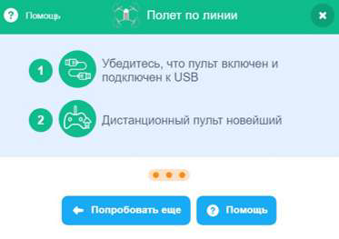</img>

7. (37) Соедините аппаратуру управления с компьютером через USB кабель, нажмите K0, чтобы перейти в
    режим программирования (постоянно горит зеленый цвет светодиода). Нажмите «Попробовать еще раз»:

    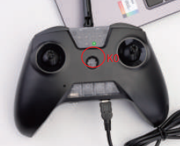</img>

8. (38) Scratch-программирование: нажмите **Код -> Файл -> Загрузить с компьютера**:

    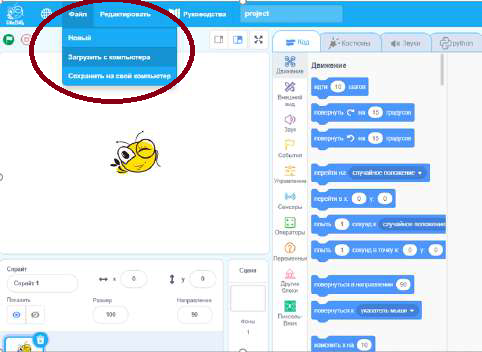</img>

9. (39) Поставьте квадрокоптер на ровную ровную поверхность камерой от себя.
    Чтобы запустить программу нажмите зеленый флажок в программном обеспечении LitebeeGo:

10. (40) Как программировать на Python. Нажмите **Python -> Запуск -> Открыть**
    и откройте программу в формате **.py**:

    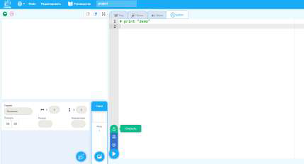</img>

11. (41) Поставьте квадрокоптер на ровную поверхность камерой от себя.

12. (42) Чтобы запустить программу нажмите **Запуск**, квадрокоптер начнет выполнять программу.

    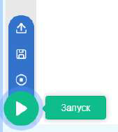</img>

## Управление квадрокоптером с помощью мобильного приложения

1. (43) Установите приложение LiteBee в Play Store:

    </img>

2. (44) Включите и поставьте квадрокоптер на ровную повернхность камерой от себя.

3. (45) Предоставьте разрешение на использование местоположения:

    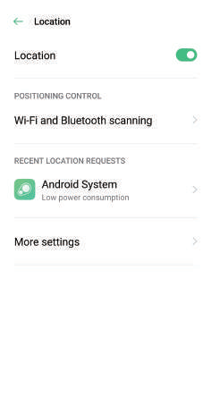</img>

4. (46) Зайдите в «Настройки» на телефоне и подключитесь к сети «Wi-Fi» квадрокоптера
    **Litebeewing_XXXX**, пароль: **12345678**:

    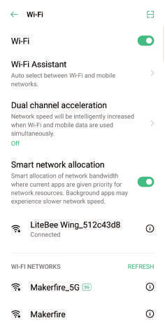</img>

5. (47) Зайдите в приложение Litebee и нажмите «Litebee wing»:

    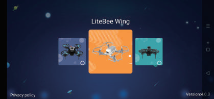</img>

6. (48) Предоставьте разрешение на хранение, если приложение спросит:

    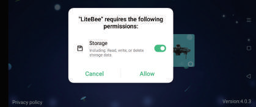</img>

7. (49) Выберите значок «Аппаратуры управления»:

    </img>

8. (50) Щелкните значок «Калибровка»:

    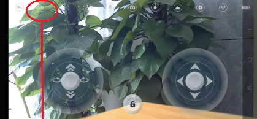</img>

9. (51) Нажмите значок «Блокировка» и сдвиньте ползунок вправо для разблокировки,
    после чего квадрокоптер взлетит автоматически:

    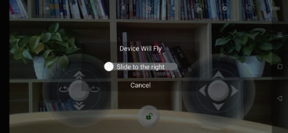</img>

    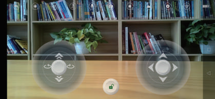</img>

10. (52) Нажмите значок «Заблокировать» еще раз, чтобы посадить квадрокоптер.

    Функции:

    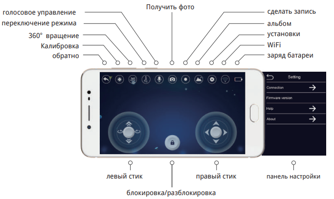</img>

## Программирование квадрокоптера с помощью мобильного приложения

1. (53) Выберите значок «Программирование» и перейдите к программированию:

    </img>

2. (54) Обязательно добавляйте «Задержки 5 секунд» на каждом шаге. Нажмите значок «Воспроизвести» и
    квадрокоптер начнет выполнять написанную программу:

    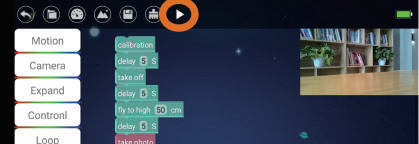</img>

3. (55) Сохранение программына телефоне:

    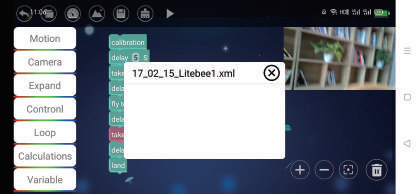</img>

4. (56) Функции программирования:

    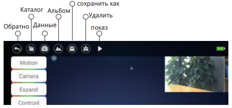</img>
