# Конструктор БПЛА «Пиксель-Вжик - рой дронов»

## Программное обеспечение

* [Программное обеспечение](https://www.tezona.ru/download/avia-application/)
* [Драйверы для Win 8/10](https://www.tezona.ru/data/uploads/files/driver_for_win_8_or_10.zip)
* [Драйверы для Win 7](https://www.tezona.ru/data/uploads/files/driver_for_win_7.zip)
* [Драйверы для Mac](https://www.tezona.ru/data/uploads/files/mac_osx_vcp_driver.zip)

## Документация

* [Технический паспорт «Пиксель-Вжик - рой дронов»](https://www.tezona.ru/data/uploads/files/tehnicheskiy_pasport_pikselvzhik-roydronov.pdf)
* [Инструкция по эксплуатации «Пиксель-Вжик - рой дронов»](https://www.tezona.ru/data/uploads/files/vzhik_manual_a5_print.pdf)

### Состав конструктора

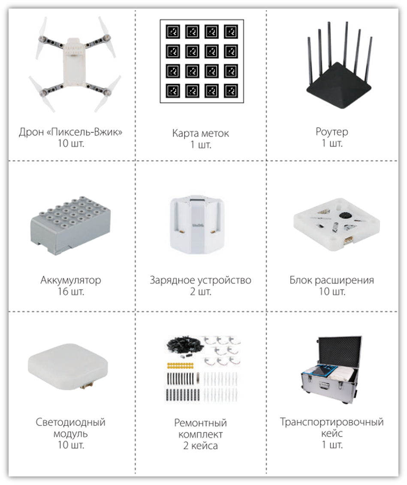

### Подготовка к полету

Вставьте аккумулятор:

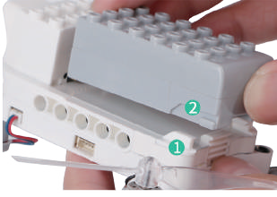
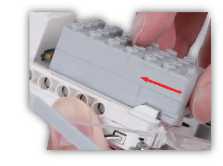

Присоедините светодиодный модуль:

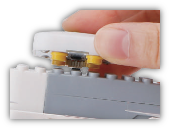

Вставьте блок питания роутера в розетку для подлключения дронов и компьютера:

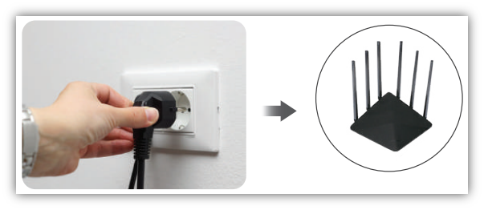

### Установка программного обеспечения

[Скачайте и установите программное обеспечение.](https://www.tezona.ru/download/avia-application)

Ознакомьтесь с меню:

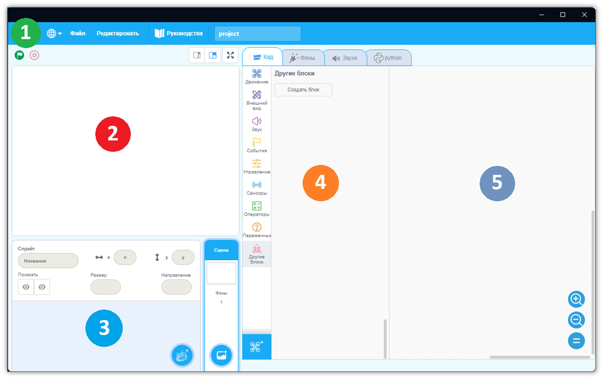

### Переключение в режим «рой дронов»

Нажмите **Добавить расширение**:

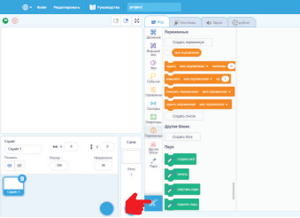

Выберите **Рой дронов**:

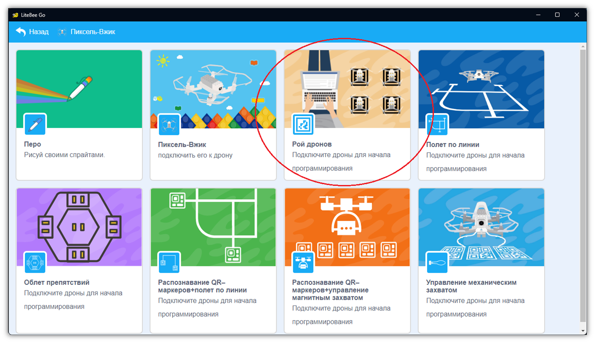

Подключитесь к роутеру:

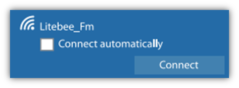

> **Подсказка** Название сети - **Litebee_Fm**, пароль - **test1234**.

### Запуск полетной программы

Загрузите полетную программу из примеров:

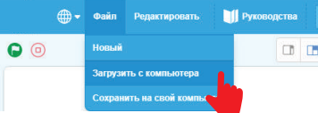

Выберите, например, 8 дронов:

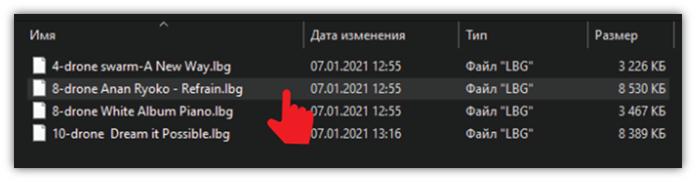

Расстелите карту меток на полу и расположите на ней дроны.

Для включения нажмите и удерживайте кнопку питания на корпусе дрона в течении 1-3 секунды:

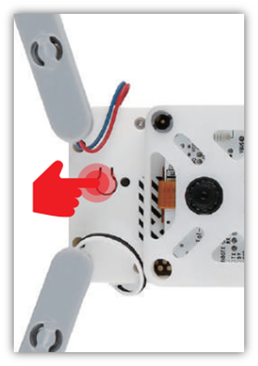

Дрон будет подключен, когда его светодиод загорится **зеленым**.

Программа покажет блок **«номер дрона: 1»**. Цифра будет увеличиваться по мере подключения дронов:

Для определения номера дрона наведите указатель мыши на блок **«высота»** и поднимите дрон вверх. Строка, где будет изменяться значение - номер вашего дрона:

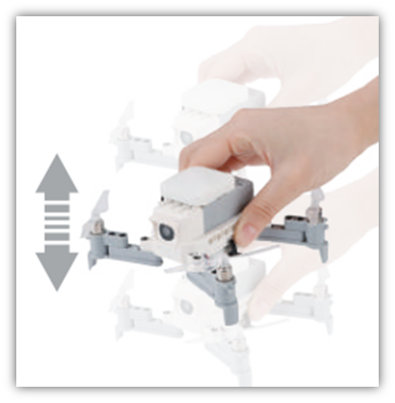
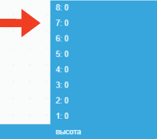

> **Подсказка** Левая часть подписи блока - это идентификатор дрона, а правая часть - значение.

Разместите дроны на карте меток. Возьмем, например, программу **8 дронов**:

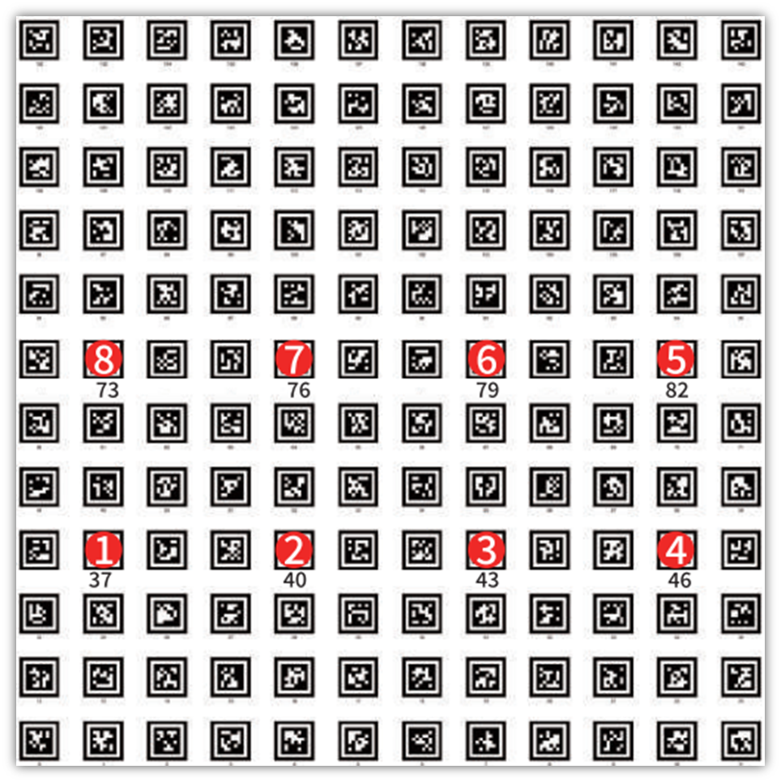

> **Внимание** Места для взлета должны соответствовать программе. Цифы на карте меток - номер дрона.

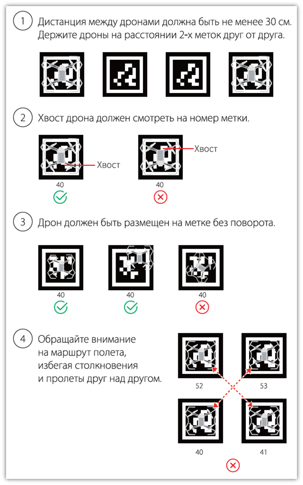

### Тестирование полетной программы

Скомпилируйте программу, нажав на **зеленый флажок**:

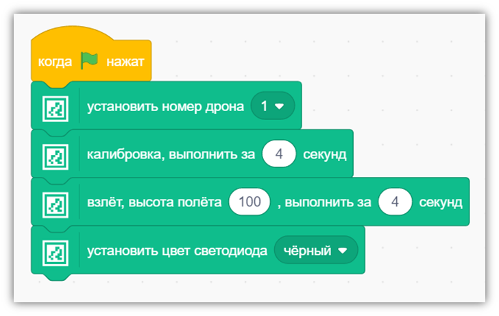

Нажмите на кнопку в виде глаза, чтобы запустить симулятор:

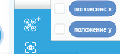

Внутри симулятора подключитесь к программе:

Вернитесь на рабочее поле и запишите миссию на борт дрона:

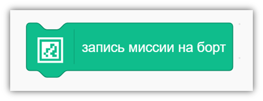

В симуляторе нажмите на кнопку начала симуляции:

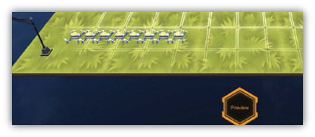

### Меры предосторожности/проблемы

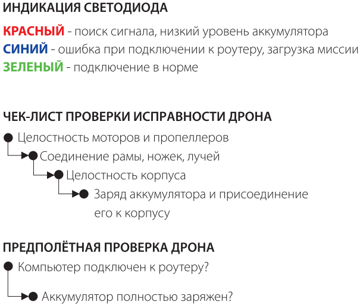

### Порядок замены аккумулятора

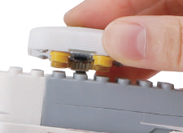
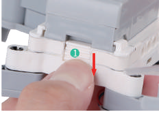
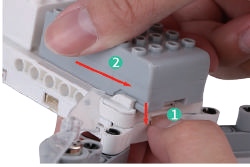

### Полёт

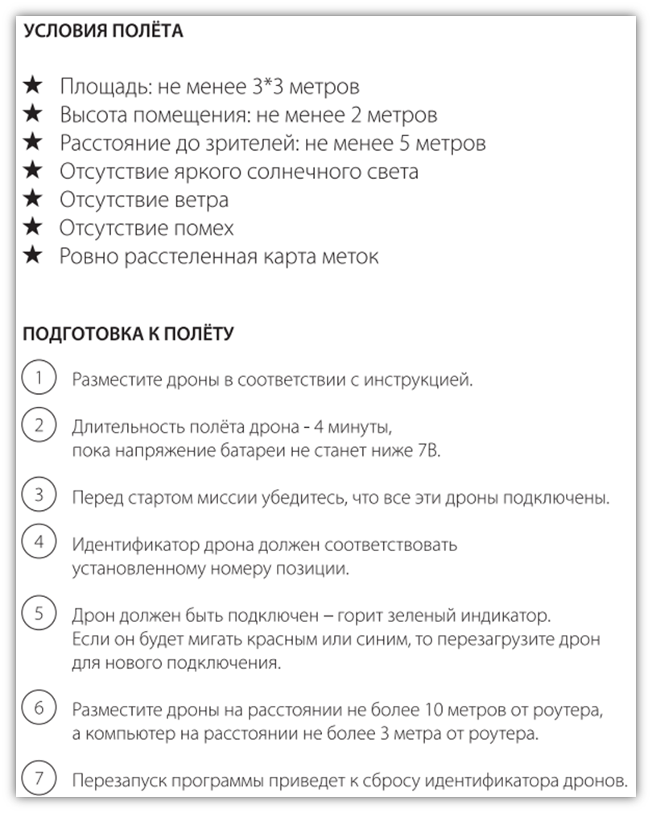
