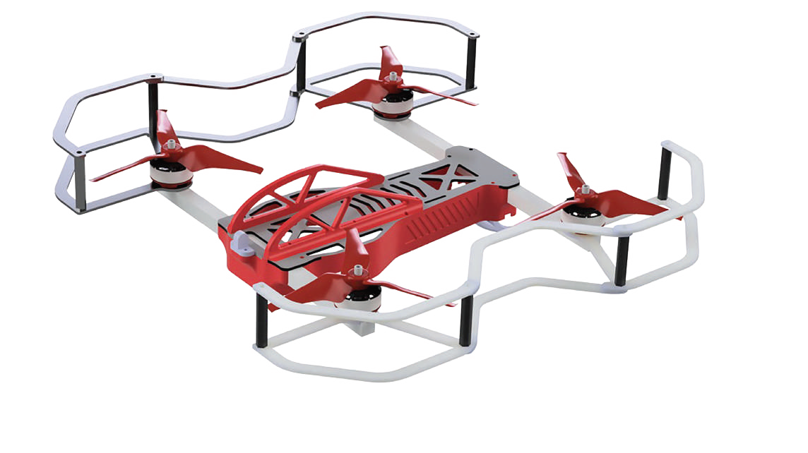
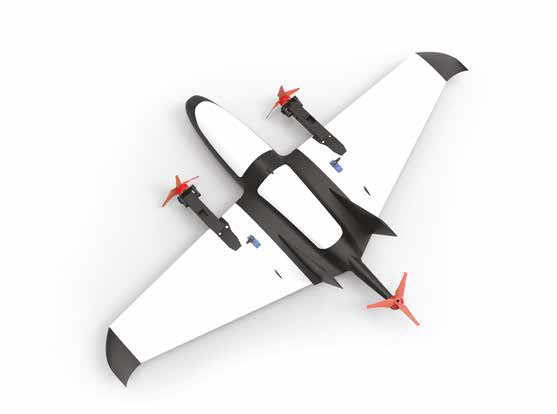
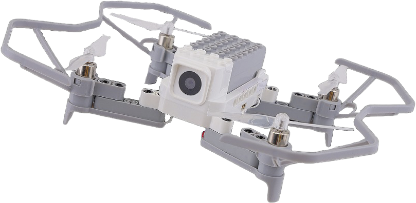
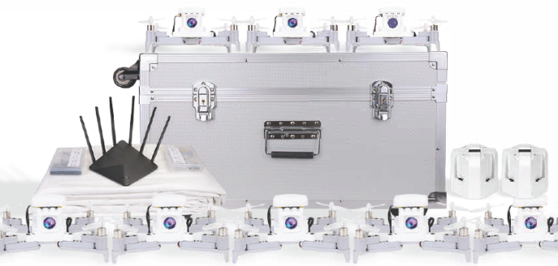

# Инструкции по сборке и настройке

В этом разделе находятся статьи с инструкциями по сборке и настройке БПЛА.

<table class=versions>
     <tr>
          <td><a href="assemble_drone1.md">Конструктор мультироторного типа «Оса»</a></td>
          <td></td>
     </tr>
     <tr>
          <td><a href="assemble_drone2.md">Конструктор самолетного типа «Орленок»</a></td>
          <td></td>
     </tr>
     <tr>
          <td><a href="assemble_drone3_1.md">Конструктор «Пиксель-Вжик»</a></td>
          <td></td></a></td>
     </tr>
     <tr>
          <td><a href="assemble_drone3_2.md">Конструктор «Пиксель-Вжик - рой дронов»</a></td>
          <td></td></a></td>
     </tr>
</table>
