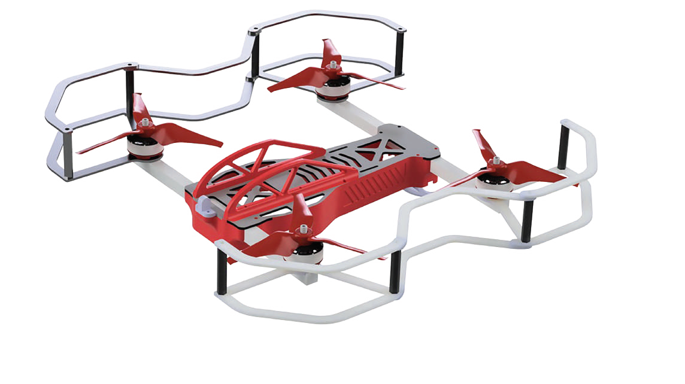
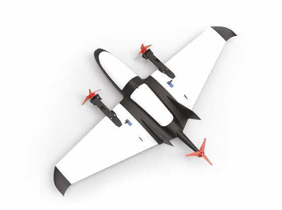
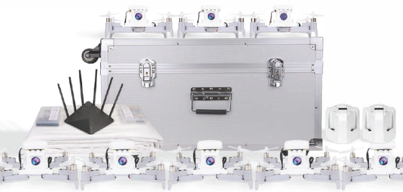

# Инструкции по сборке и настройке

В этом разделе находятся статьи с инструкциями по сборке и настройке БПЛА.

<table class=versions>
     <tr>
          <td><a href="assemble_drone1.md">Конструктор мультироторного типа «Оса»</a></td>
          <td></td>
     </tr>
     <tr>
          <td><a href="assemble_drone2.md">Конструктор самолетного типа «Орленок»</a></td>
          <td></td>
     </tr>
     <tr>
          <td><a href="assemble_drone3.md">Конструктор «Пиксель-Вжик»</a>
               

                    <a href="assemble_drone1.md"> и «Пиксель-Вжик - рой дронов»</a>
               

          </td>
          <td></td></a></td>
     </tr>
</table>
