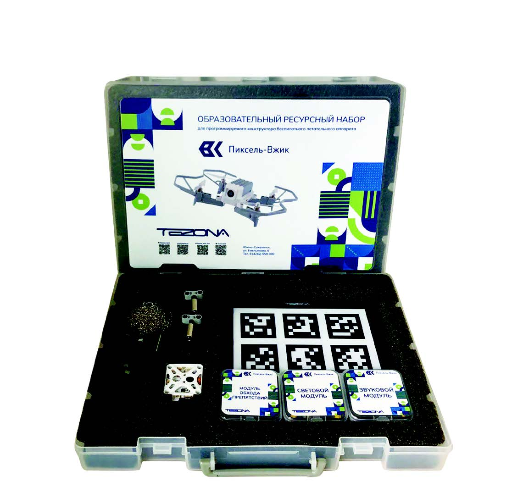

# Инструкции по сборке и настройке

В этом разделе находятся статьи с инструкциями по сборке и настройке БПЛА.

<table class=versions>
     <tr>
          <td>Конструктор «Пиксель-Вжик»</td>
          <td></td>
            <td align="left">
            Программное обеспечение
            <li><a href="https://www.tezona.ru/download/avia-application/">Программное обеспечение</a></li>
            <li><a href="https://www.tezona.ru/data/uploads/files/driver_for_win_8_or_10.zip">Драйверы для Win 8/10</a></li>
            <li><a href="https://www.tezona.ru/data/uploads/files/driver_for_win_7.zip">Драйверы для Win 7</a></li>
            <li><a href="https://www.tezona.ru/data/uploads/files/mac_osx_vcp_driver.zip">Драйверы для Mac</a></li>
            Документация
            <li><a href="https://www.tezona.ru/data/uploads/files/tehnicheskiy_pasport_piksel.pdf">Технический паспорт «Пиксель-Вжик»</a></li>
            <li><a href="https://www.tezona.ru/data/uploads/files/piksel-vzhik_instruktsiya.pdf">Инструкция по эксплуатации «Пиксель-Вжик»</a></li>
            </td>
     </tr>
     <tr>
          <td>Конструктор «Пиксель-Вжик - рой дронов»</td>
          <td></td>
            <td align="left">
            Программное обеспечение
            <li><a href="https://www.tezona.ru/download/avia-application/">Программное обеспечение</a></li>
            <li><a href="https://www.tezona.ru/data/uploads/files/driver_for_win_8_or_10.zip">Драйверы для Win 8/10</a></li>
            <li><a href="https://www.tezona.ru/data/uploads/files/driver_for_win_7.zip">Драйверы для Win 7</a></li>
            <li><a href="https://www.tezona.ru/data/uploads/files/mac_osx_vcp_driver.zip">Драйверы для Mac</a></li>
            Документация
            <li><a href="https://www.tezona.ru/data/uploads/files/tehnicheskiy_pasport_pikselvzhik-roydronov.pdf">Технический паспорт «Пиксель-Вжик - рой дронов»</a></li>
            <li><a href="https://www.tezona.ru/data/uploads/files/vzhik_manual_a5_print.pdf">Инструкция по эксплуатации «Пиксель-Вжик - рой дронов»</a></li>
            </td>
     </tr>
     <tr>
          <td>Конструктор мультироторного типа «Оса»</td>
          <td></td>
            <td align="left">
            Документация
            <li><a href="https://www.tezona.ru/data/uploads/files/osa_pasport.pdf">Технический паспорт</a></li>
            <li><a href="https://www.tezona.ru/data/uploads/files/stl_osa.zip">STL файлы</a></li>
            <li><a href="https://www.tezona.ru/data/uploads/files/osa-manual.pdf">Инструкция по сборке PDF</a></li>
            <li><a href="https://mail.tezona.ru/оса/инструкция.mp4">Видеоинструкция сборки</a></li>
            <li><a href="https://www.tezona.ru/data/uploads/files/osa-kalibrovka.mp4">Видеоинструкция калибровки</a></li>
            </td>
     </tr>
     <tr>
          <td>Конструктор самолетного типа «Орленок»</td>
          <td></td>
            <td align="left">
            Документация
            <li><a href="https://www.tezona.ru/data/uploads/files/tehpasport__orlenok.pdf">Технический паспорт</a></li>
            <li><a href="https://www.tezona.ru/data/uploads/files/stl_orlenok.zip">STL файлы</a></li>
            <li><a href="https://www.tezona.ru/data/uploads/files/orlenok_instruktsiya_po_sborke_korpusa.pdf">Инструкция по сборке PDF</a></li>
            <li><a href="https://www.tezona.ru/data/uploads/files/Orlenok-instrukcia-1.webm">Видеоинструкция сборки часть 1</a></li>
            <li><a href="https://www.tezona.ru/data/uploads/files/Orlenok-podkluchenie-i-nastroika.mp4">Видеоинструкция сборки часть 2</a></li>
            <li><a href="https://www.tezona.ru/data/uploads/files/Orlenok-nastroika-pc.mp4">Видеоинструкция прошивки полетного контроллера</a></li>
            </td>
     </tr>
     <tr>
     <td>Конструктор спортивного мультироторного типа для FPV-пилотирования «Олимпиец»</td>
     <td></td>
          <td align="left">
          Документация
          <li><a href="https://www.tezona.ru/data/uploads/files/description_olimpiec.pdf">Описание</a></li>
          <li><a href="https://www.tezona.ru/data/uploads/files/tehpasport_olimpiec.pdf">Технический паспорт</a></li>
          <li><a href="https://www.tezona.ru/data/uploads/files/manual_olimpiec.pdf">Инструкция по сборке и настройке PDF</a></li>
          </td>
     </tr>
     <tr>
     <td>Развивающий набор для FPV-пилотирования «Чижик»</td>
     <td></td>
          <td align="left">
          Документация
          <li><a href="https://www.tezona.ru/data/uploads/files/manual_chizhik.pdf">Инструкция по эксплуатации</a></li>
          <li><a href="https://www.tezona.ru/data/uploads/files/tehpasport_chizhik.pdf">Технический паспорт</a></li>
          </td>
     </tr>
     <tr>
     <td>Образовательный ресурсный набор для программирования конструктора БПЛА «Пиксель-Вжик»</td>
     <td></td>
          <td align="left">
          Документация
          <li><a href="https://www.tezona.ru/data/uploads/files/manual_resourcekit_pixel.pdf">Инструкция по эксплуатации</a></li>
          <li><a href="https://www.tezona.ru/data/uploads/files/tehpasport_resourcekit_pixel.pdf">Технический паспорт</a></li>
          </td>
     </tr>
</table>
