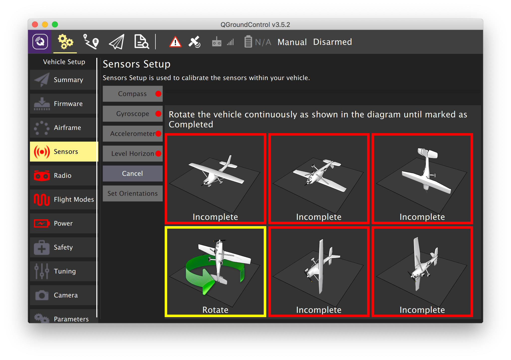
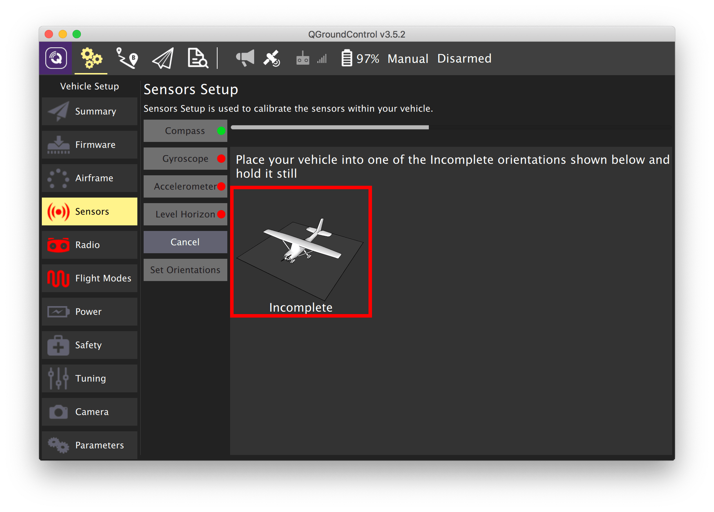
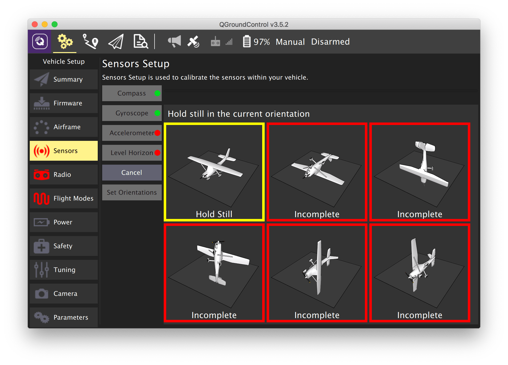
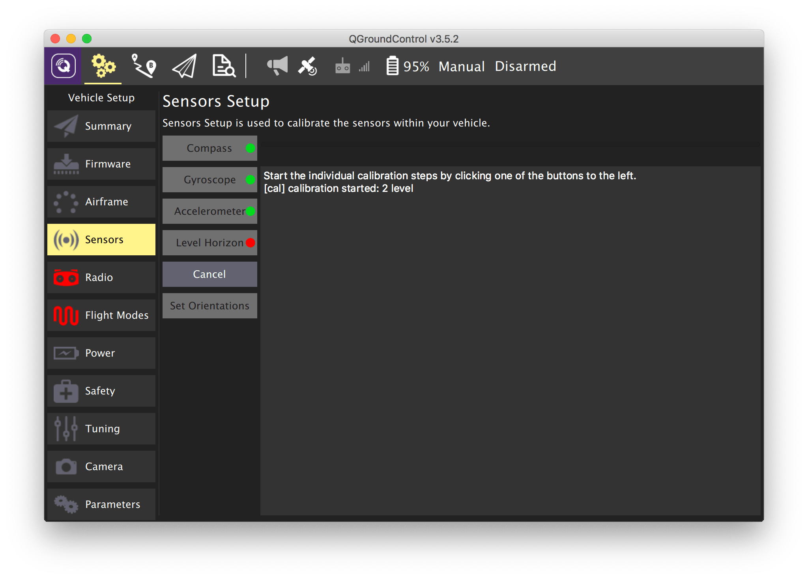

# Калибровка датчиков

Чтобы откалибровать датчики зайдите во вкладку *Vehicle Setup* и выберите меню *Sensors*.

> **Caution** Если вы используете полетный контроллер $\color{red}{\textsf{🔴название контроллера?}}$ [*COEX Pix*](coex_pix.md) и он установлен серворазъемами назад (как на изображениях в инструкции), то во всех графах *Autopilot Orientation* необходимо указать значение $\color{red}{\textsf{🔴значения на каждый дрон}}$ `ROTATION_ROLL_180_YAW_90`, иначе полетный контроллер будет некорректно воспринимать наклоны и повороты коптера.

## Компас

1. Выберите меню *Compass*.
2. Выберите ориентацию полетного контроллера – *ROTATION_NONE* при условии, что полетный контроллер ориентирован передом к носу квадрокоптера.
3. Нажмите *OK*.
4. Последовательно устанавливайте квадрокоптер в каждую из указанных ориентаций до появления желтой рамки.
5. Вращайте квадрокоптер по направлению стрелки до появления зеленой рамки.

> **Warning** Последние версии прошивки PX4 не поддерживают внутренний компас на полетном контроллере COEX Pix. При появлении ошибки *No mags found* перейдите во вкладку *Parameters*, установите параметры `SYS_HAS_MAG` в `0`, `EKF2_MAG_TYPE` в `None` и перезагрузите полетный контроллер (*Tools* => *Reboot Vehicle*).

Дополнительная информация: https://docs.px4.io/master/en/config/compass.html.

## Гироскоп

1. Выберите меню *Gyroscope*
2. Установите квадрокоптер на ровную поверхность.
3. Нажмите *OK*.
4. Дождитесь окончания калибровки.

> **Warning** Во время калибровки гироскопа квадрокоптер не должен менять своего положения, шататься и т. д.

Дополнительная информация: https://docs.px4.io/master/en/config/gyroscope.html.

## Акселерометр

1. Выберите меню *Accelerometer*.
2. Выберите ориентацию полетного контроллера – *ROTATION_NONE* при условии, что полетный контроллер ориентирован передом к носу квадрокоптера.
3. Последовательно устанавливайте квадрокоптер в каждую из указанных ориентаций до появления желтой рамки.
4. Держите квадрокоптер неподвижно до появления зеленой рамки.

Дополнительная информация: https://docs.px4.io/master/en/config/accelerometer.html.

## Уровень горизонта

1. Выберите меню *Level Horizon*.
2. Выберите ориентацию полетного контроллера – *ROTATION_NONE* при условии, что полетный контроллер ориентирован передом к носу квадрокоптера.
3. Установите квадрокоптер на ровную поверхность.
4. Нажмите *OK*.
5. Дождитесь окончания калибровки.

Дополнительная информация: https://docs.px4.io/master/en/config/level_horizon_calibration.html.

**Далее**: [Настройка пульта](radio.md).
