# Настройка камеры

Для корректной работы всех функций, связанных с компьютерным зрением (в том числе [полета по ArUco-маркерам](aruco.md) и [Optical Flow](optical_flow.md)) необходимо сфокусировать основную камеру, а также выставить ее расположение и ориентацию. Улучшить качество работы также может опциональная калибровка камеры.

## Настройка фокуса камеры {#focus}

Для успешного осуществления полетов с использованием камеры, необходимо настроить фокус камеры.

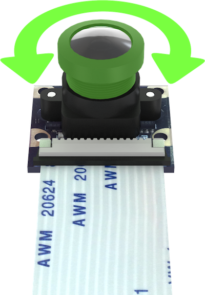

1. Откройте трансляцию изображения с камеры используя [web_video_server](web_video_server.md).
2. С помощью вращения объектива камеры добейтесь максимальной резкости деталей (предпочтительно на расстоянии предполагаемой высоты полета – 2–3 м).

|Расфокусированное изображение|Сфокусированное изображение|
|-|-|
|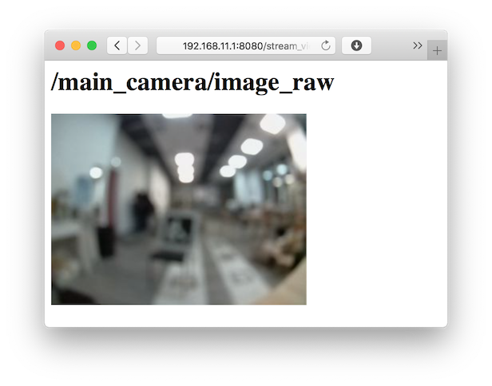|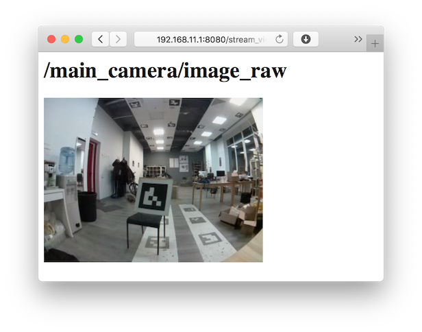|

## Настройка расположения камеры {#frame}

Расположение и ориентация камеры [задается в файле](cli.md#editing) `~/catkin_ws/src/clover/clover/launch/main_camera.launch`: $\color{red}{\textsf{🔴директория}}$

```xml
<arg name="direction_z" default="down"/> <!-- direction the camera points: down, up -->
<arg name="direction_y" default="backward"/> <!-- direction the camera cable points: backward, forward -->
```

Для того, чтобы задать ориентацию, необходимо установить:

* направление обзора камеры `direction_z`: вниз (`down`) или вверх (`up`);
* направление, в которое указывает шлейф камеры `direction_y`: назад (`backward`) или вперед (`forward`).

### Примеры

#### Камера направлена вниз, шлейф назад

```xml
<arg name="direction_z" default="down"/>
<arg name="direction_y" default="backward"/>
```

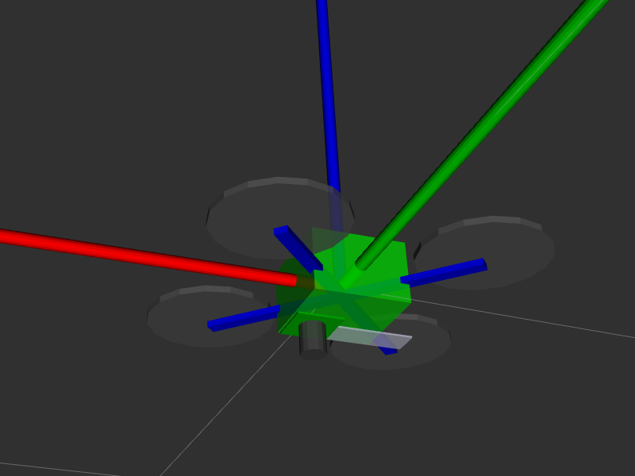
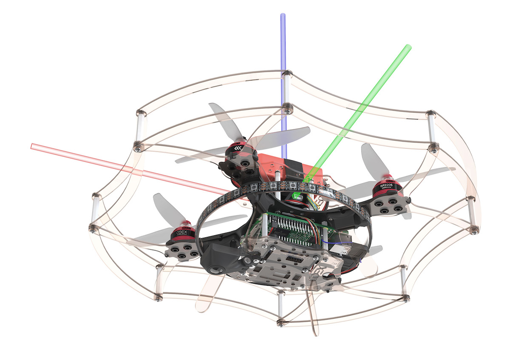

#### Камера направлена вниз, шлейф вперёд

```xml
<arg name="direction_z" default="down"/>
<arg name="direction_y" default="forward"/>
```

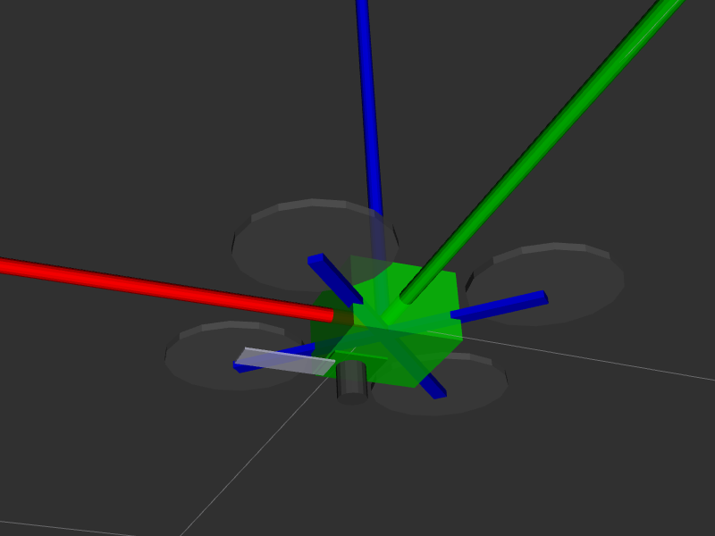
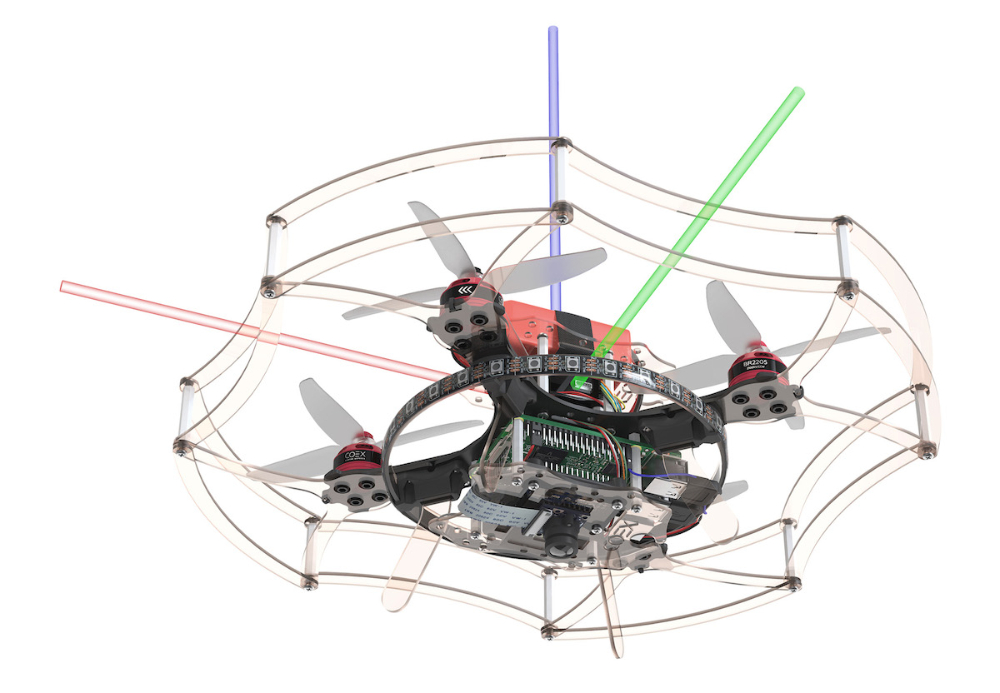

#### Камера направлена вверх, шлейф назад

```xml
<arg name="direction_z" default="up"/>
<arg name="direction_y" default="backward"/>
```

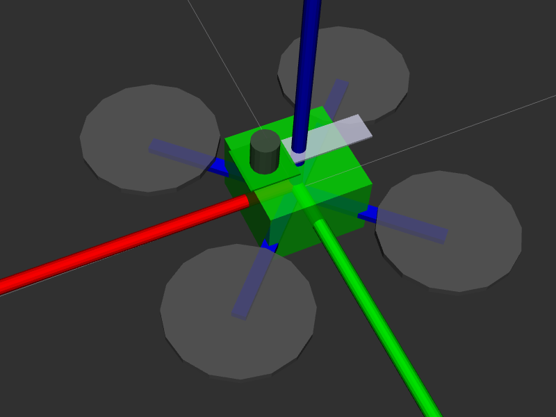
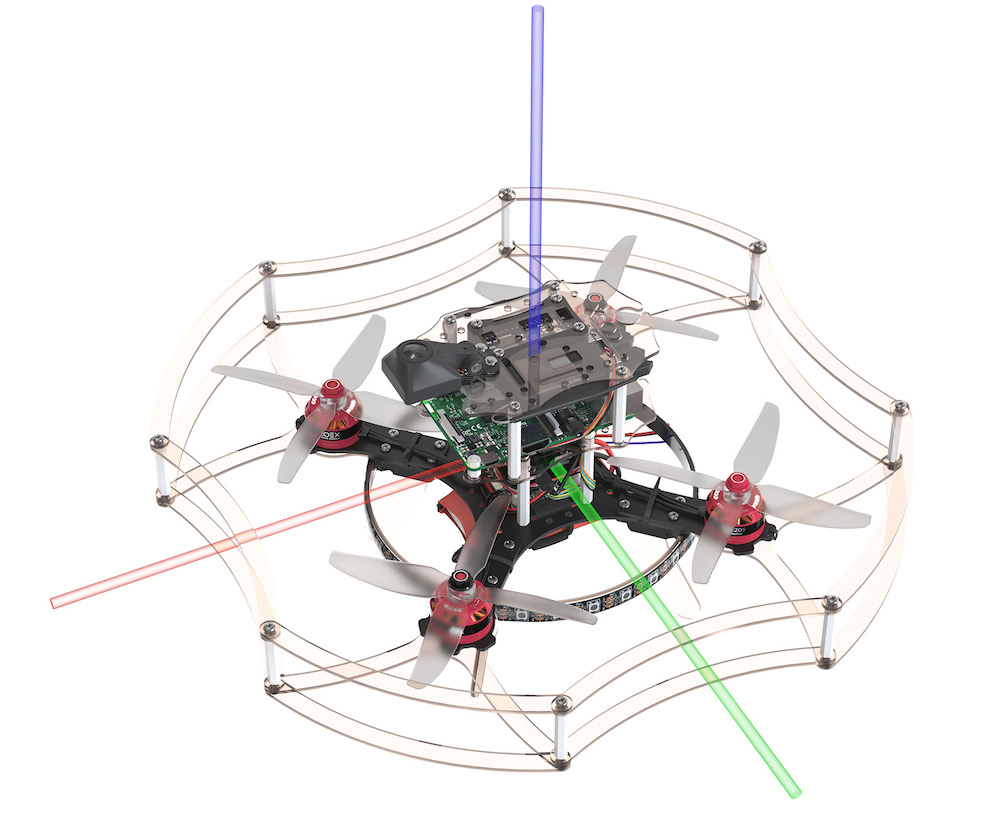

#### Камера направлена вверх, шлейф вперёд

```xml
<arg name="direction_z" default="up"/>
<arg name="direction_y" default="forward"/>
```

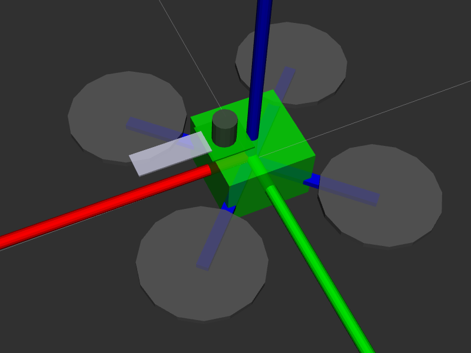
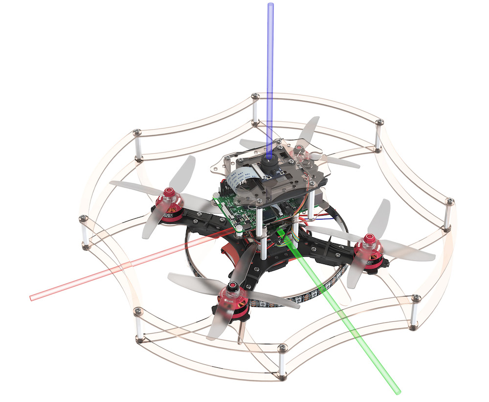

> **Hint** [Утилита `selfcheck.py`](selfcheck.md) выдает словесное описание установленной в данной момент ориентации основной камеры.

### Произвольное расположение камеры

Также возможны произвольное расположение и ориентация камеры. Для этого раскомментируйте запуск ноды, подписанной как `Template for custom camera orientation`:

```xml
<!-- Template for custom camera orientation -->
<!-- Camera position and orientation are represented by base_link -> main_camera_optical transform -->
<!-- static_transform_publisher arguments: x y z yaw pitch roll frame_id child_frame_id -->
<node pkg="tf2_ros" type="static_transform_publisher" name="main_camera_frame" args="0.05 0 -0.07 -1.5707963 0 3.1415926 base_link main_camera_optical"/>
```

Эта строка задает статическую трансформацию между фреймом `base_link` ([соответствует корпусу полетного контроллера](frames.md)) и камерой (`main_camera_optical`) в формате:

```txt
сдвиг_x сдвиг_y сдвиг_z угол_рысканье угол_тангаж угол_крен
```

Фрейм камеры задается таким образом, что:

* **<font color=red>x</font>** указывает направо на изображении;
* **<font color=green>y</font>** указывает вниз на изображении;
* **<font color=blue>z</font>** указывает от плоскости матрицы камеры.

Сдвиги задаются в метрах, углы задаются в радианах. Корректность установленной трансформации может быть проверена с использованием [rviz](rviz.md).

## Калибровка {#calibration}

Для улучшения качества работы алгоритмов также рекомендуется произвести калибровку камеры, процесс которой описан [в отдельной статье](camera_calibration.md).
