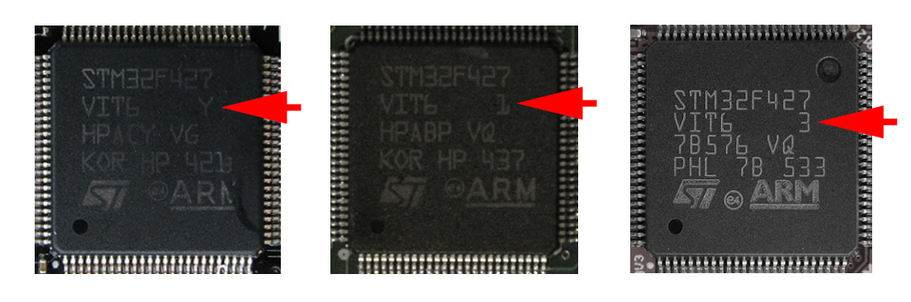

Прошивка полетного контроллера
===

Pixhawk, Pixracer и [COEX Pix](coex_pix.md) можно прошить, используя QGroundControl или утилиты командной строки.

QGroundControl
---

В QGroundControl откройте раздел Firmware. **После** этого подключите полетный контроллер по USB.

Выберите PX4 Flight Stack. Для скачивания и загрузки стандартной прошивки (вариант с EKF2 для Pixhawk) выберите пункт меню "Standard Version", для загрузки собственного файла прошивки выберите пункт "Custom firmware file...", затем нажмите OK.

> **Warning** Не отключайте USB-кабель до окончания процесса прошивки.

Варианты прошивок
---

В названии файла прошивки кодируется информации о целевой плате и варианте сборки. Примеры:

* `px4fmu-v4_default.px4` — прошивка для COEX Pix и Pixracer с EKF2 и LPE.
* `px4fmu-v2_lpe.px4` — прошивка для Pixhawk с LPE.
* `px4fmu-v2_default.px4` — прошивка для Pixhawk с EKF2.
* `px4fmu-v3_default.px4` — прошивка для более новых версий Pixhawk (чип ревизии 3, см. илл. + Bootloader v5) с EKF2 и LPE.



> **Note** Для загрузки `px4fmu-v3_default.px4` может понадобиться использование команды `force_upload` из командной строки.

Командная строка
---

PX4 может быть собран из исходников и загружен в плату автоматически из командной строки.

Для это склонируйте репозиторий PX4:

```bash
git clone https://github.com/PX4/PX4-Autopilot.git
```

Выберите необходимую версию (тэг) с помощью `git checkout`. Затем соберите и загрузите прошивку:

```bash
make px4_fmu-v4_default upload
```

Где `px4_fmu-v4_default` – требуемый вариант прошивки.

Для загрузки прошивки `v3` в Pixhawk может понадобиться команда `force_upload`:

```bash
make px4_fmu-v3_default force-upload
```
