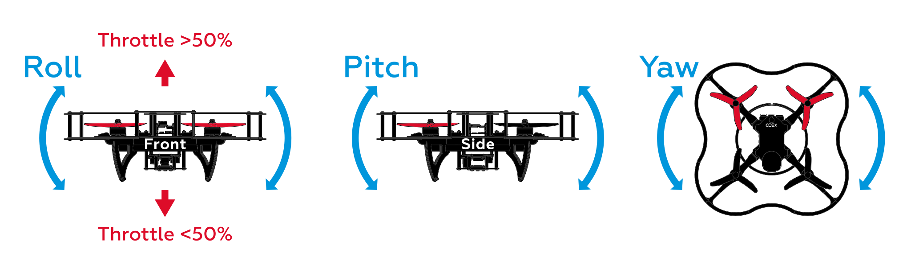
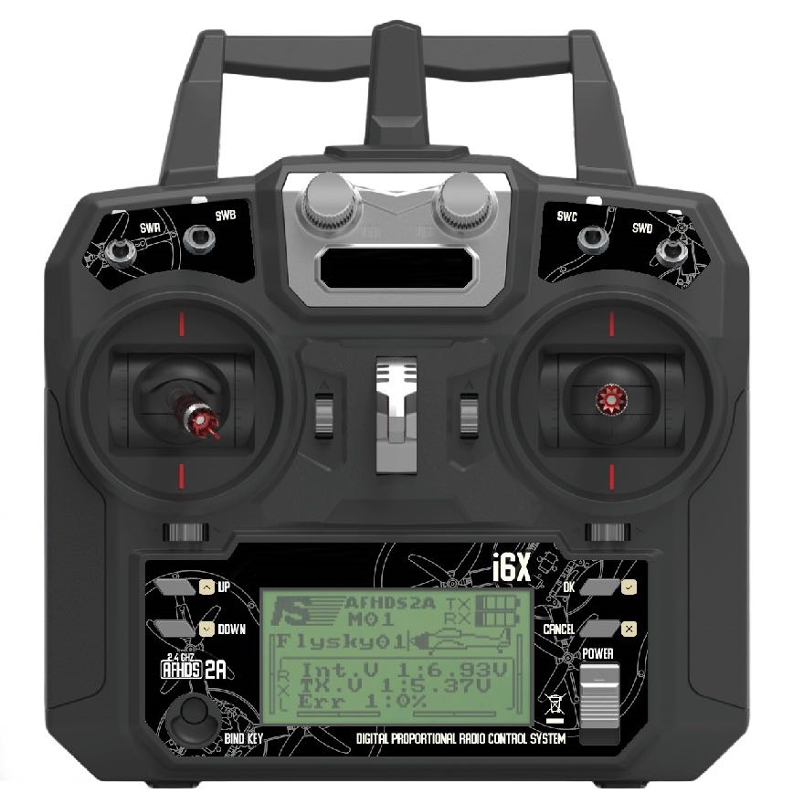

# Полет

Этот раздел объясняет основы управление квадрокоптером с использование пульта радиоуправления в различных режимах (для автономных полетов смотрите раздел "[Программирование](programming.md)").

## Основные возможности радиоаппаратуры

Прежде чем запускать ваш коптер, необходимо разобраться, как работает пульт радиоуправления ("аппаратура" в общепринятой терминологии авиамоделизма).

Управление дроном происходит с помощью двух стиков на аппаратуре. По умолчанию левый стик отвечает за газ и рысканье, а правый за крен и тангаж. Данные термины используются для всех летательных судов, от самолетов до квадрокоптеров.

🔴изображение

* Газ (*throttle*) – отвечает за скорость вращения двигателей.
* Рысканье (*yaw*) – отвечает за повороты вокруг вертикальной оси (Z), по часовой (при наклоне вправо) и против часовой (при наклоне влево) стрелки.
* Тангаж (*pitch*) – отвечает за наклон или движение вперёд/назад.
* Крен (*roll*) – отвечает за наклон или движение влево/вправо.

Данные описания предполагают, что коптер находится задней частью к пилоту.

## Полетные режимы

Ручное полет с использованием полетного контроллера PX4 может происходит с использованием разных полетных режимов, которые определяют назначения стиков радиопульта и другие характеристики полета. Полный список полетных режимов приведен в статье "[Полетные режимы](modes.md)".

Основные ручные режимы разобраны далее.

**STABILIZED** - режим стабилизации горизонтального положения. В данном режиме коптер будет удерживать горизонт, если им не управлять. Назначение стиков:

* Газ – усредненная скорость вращения моторов.
* Рысканье – угловая скорость вокруг вертикальной оси.
* Тангаж – угол наклона вокруг поперечной оси (вперед/назад).
* Крен – угол наклон вокруг продольной оси (влево/вправо).

**POSCTL** – режим удержания позиции (требуется включенная система позиционирования). Назначение стиков:

* Газ - вертикальная скорость полета.
* Рысканье - угловая скорость вокруг вертикальной оси.
* Тангаж - линейная скорость полета дрона (вперед/назад).
* Крен - линейная скорость полета дрона (влево/вправо).

**ACRO** – режим управление средней скоростью вращения моторов и угловыми скоростями дрона. Этот режим является наиболее сложным для пилотирования и чаще всего применяется дрон-рейсерами и в шоу 3D-пилотирования для выполнения трюков. Назначение стиков:

* Газ – усредненная скорость вращения моторов.
* Рысканье – угловая скорость вокруг вертикальной оси.
* Тангаж – угловая скорость вокруг поперечной оси (вперед/назад).
* Крен – угловая скорость вокруг продольной оси (влево/вправо).

> **Info** В других полетных контроллерах аналогичные полетные режимы могут называться по-другому.

## Подготовка к полету

### Состояния готовности к полету

Прежде чем начинать полет, необходимо перевести коптер в состояние *Armed*.

* Состояние *Armed* – моторы вращаются в соответствии с положением стика газа, коптер готов к полету.
* Состояние *Disarmed* – моторы не вращаются, коптер не реагирует на стик газа.

По умолчанию коптер находится в состоянии *Disarmed* и переходит в него в случае если вы долго не взлетаете.

Для перевода коптера в состояние *Armed* есть несколько способов:

* С помощью стика – переведите левый стик вниз вправо и подождите пару секунд.
  

* С помощью тумблера – состояния Armed/Disarmed можно настроить на один из тумблеров. Подробнее о настройке в смотрите в статье про [полетные режимы](modes.md).
* С помощью QGC – вы можете заармить ваш дрон программно. Для этого нажмите на надпись *Disarmed* в шапке и выберите другое состояние.
* С помощью [программы](programming.md) - коптер может перейти в состояние *Armed*, если в навигационной команде, такой как `navigate`, `set_position` и т.д., указан параметр `auto_arm=True`.

### Kill switch

При активации тумблера *Kill Switch* на моторы перестают посылаться сигналы управления, и моторы перестают вращаться. Эта функция используется в крайних случаях, к примеру, если вы потеряли управление над коптером.

> **Caution** Будьте внимательны, *Kill Switch* не переводит коптер в состояние *Disarmed*!

Перед отключением *Kill Switch* убедитесь, что стик газа находится в нижнем положении и коптер находится в состоянии *Disarmed*. В случае, если стик газа не находится в нижнем положении, при отключении *Kill Switch* на моторы будет подан сигнал соответствующий положению стика в данный момент, что приведет к резкому рывку коптера.

**Далее**: [Упражнения для управления коптером](flight_exercises.md).
