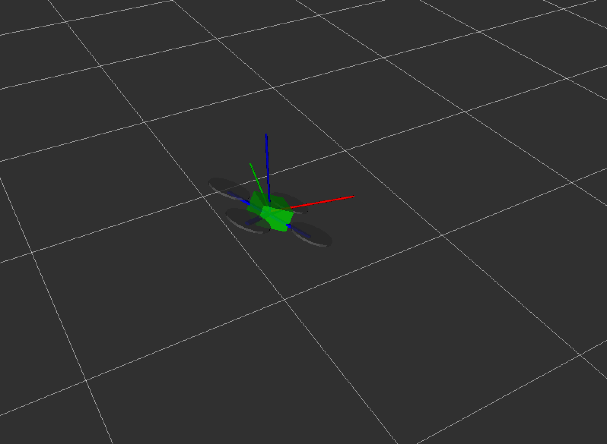

Системы координат (фреймы)
===

Основные фреймы:

* `map` — координаты относительно точки инициализации полетного контроллера: белая сетка на иллюстрации;
* `base_link` — координаты относительно дрона: схематичное изображение дрона на иллюстрации;
* `body` — координаты относительно дрона без учета наклонов по тангажу и крену: красная, синяя и зеленая линии на иллюстрации;
* `navigate_target` – координаты точки, в которую сейчас летит дрон (с использованием [navigate](simple_offboard.md#navigate));
* `terrain` – координаты относительно пола в текущей позиции коптера (см. сервис [set_altitude](simple_offboard.md#set_altitude))
* `setpoint` – текущий setpoint по позиции;
* `main_camera_optical` – система координат, [связанная с основной камерой](camera_setup.md#frame).

При использовании [системы позиционирования по ArUco-маркерам](aruco.md) появляются дополнительные фреймы:

* `aruco_map` – координаты относительно [карты ArUco-маркеров](aruco_map.md);
* `aruco_N` – координаты относительно [маркера](aruco.md) с ID=N.

> **Подсказка** В соответствии с [соглашением](http://www.ros.org/reps/rep-0103.html), для фреймов, связанных с коптером, ось X направлена вперед, Y – налево и Z – вверх.

tf2
--

Основная документация: http://wiki.ros.org/tf2

tf2 – это набор библиотек для языков программирования C++, Python и других, которые помогают работать с системами координат. ROS-ноды публикуют в топик `/tf` сообщения формата `TransformStamped`, которые содержат в себе трансформации между заданными системами координат в определенные моменты времени.

С помощью [`simple_offboard`](simple_offboard.md) можно запросить расположение коптера в любой системе координат, используя аргумент `frame_id` сервиса `get_telemetry`.

Из Python можно использовать библиотеку tf2 для преобразования геометрических объектов (например, PoseStamped, PointStamped) из одной системы координат в другую.
