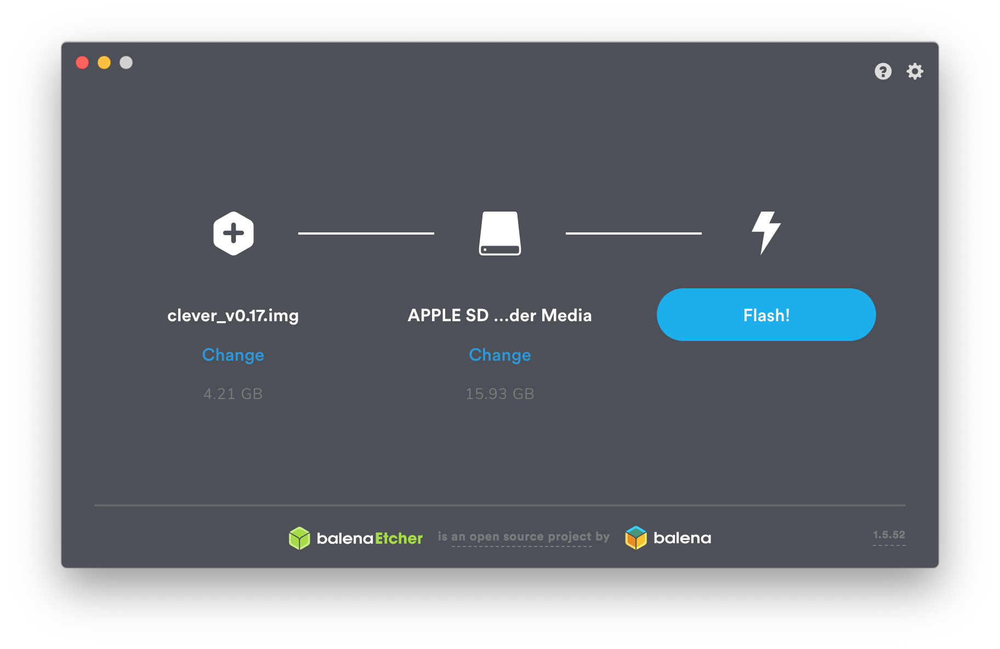

# Образ для Raspberry Pi

**Образ RPi** включает в себя все необходимое ПО для удобной работы с дроном и [программирования автономных полетов](simple_offboard.md). Платформа основана на операционной системе [Raspbian](https://www.raspberrypi.org/downloads/raspbian/) и популярном робототехническом фреймворке [ROS](ros.md).

## Использование

1. Скачайте образ — [ссылка](https://mail.tezona.ru/raspberryimage/drone.zip).
2. Скачайте и установите [программу для записи образов Etcher](https://www.balena.io/etcher/) (доступна для Windows/Linux/macOS).
3. Установите MicroSD-карту в компьютер (используйте адаптер при необходимости).
4. Запишите скачанный образ на карту, используя Etcher.
5. Установите карту в Raspberry Pi.

После записи образа на SD-карту, вы можете подключаться к дрону [по Wi-Fi](wifi.md), использовать [беспроводное соединение в QGroundControl](gcs_bridge.md), получать [доступ по SSH](ssh.md) и использовать остальные функции.

**Далее:** [Подключение по Wi-Fi](wifi.md).
