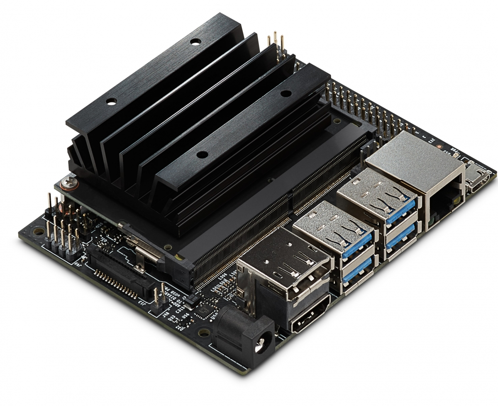
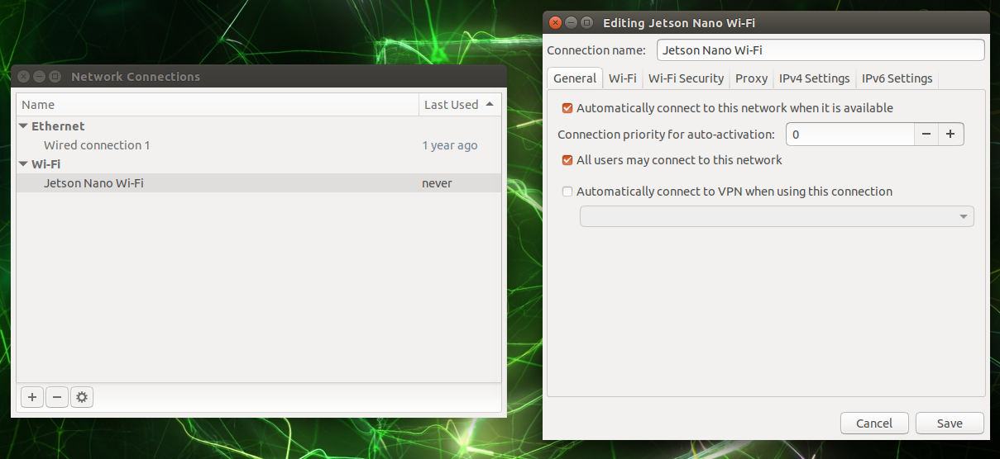

# Пакеты Клевера на Jetson Nano

## О Jetson Nano

[Jetson Nano](https://developer.nvidia.com/embedded/jetson-nano-developer-kit) – система на модуле (SoM), выпускаемая компанией Nvidia. Система построена на базе платформы Tegra X1 и несёт на себе четырёхядерный процессор ARM Cortex-A57 частотой 1.4 ГГц, 4 ГБ оперативной памяти и видеоядро на базе Nvidia Maxwell.



Набор для разработчиков Jetson Nano включает в себя как сам модуль, так и плату-носитель с портами USB 3.0, CSI, Ethernet и GPIO-пинами. Плата-носитель ненамного больше одноплатного компьютера Raspberry Pi и может быть использована в качестве бортового компьютера.

> **Note** На плате-носителе изначально нет Wi-Fi-адаптера. Для организации беспроводного подключения к Jetson Nano следует использовать USB-адаптер или Wi-Fi карту стандарта M.2. Следует свериться со списком совместимого оборудования перед установкой адаптера.

## Установка ПО

Nvidia предоставляет образ системы для Jetson Nano на базе Ubuntu 18.04. Эта версия системы поддерживается как база для ROS Melodic.

### Начальная установка

> **Hint** Более подробные инструкции можно получить на [официальном сайте Nvidia](https://developer.nvidia.com/embedded/learn/get-started-jetson-nano-devkit) для Jetson Nano.

Для начальной установки требуется использование клавиатуры, мыши и HDMI-монитора. Скачайте [образ системы Jetson Nano](https://developer.nvidia.com/jetson-nano-sd-card-image-r3231) и запишите его на карту microSD (размером не менее 16 ГБ; рекомендуется использовать карту объёмом не менее 32 ГБ). Вставьте записанную карту в модуль Jetson Nano, подключите клавиатуру, мышь и монитор к плате-носителю и подайте питание на модуль.

> **Hint** Jetson Nano можно питать от кабеля microUSB, но для повышения надёжности рекомендуется использовать специальный разъём питания. При использовании этого разъёма следует поместить перемычку на пины J48 (расположены рядом с разъёмом CSI).

Примите лицензионное соглашение на использование системы и следуйте дальнейшим указаниям установщика. После установки система автоматически перезагрузится и покажет экран входа в систему. Выберите созданного вами пользователя и введите пароль, указанный на этапе установки.

> **Info** Настоятельно рекомендуется выбрать английский язык как системный, дабы избежать возможных проблем с ROS.

Рекомендуется настроить автоматические подключение к Wi-Fi сети. Для этого после установки системы нажмите на значок Wi-Fi подключения в верхней части экрана, выберите опцию "Edit Connections..." в выпадающем меню, выделите текущую Wi-Fi сеть в открывшемся списке и нажмите на кнопку с иконкой шестерёнки.



Во вкладке "General" поставьте галочку возле пункта "All users may connect to this network". Нажмите на кнопку "Save" для применения параметров и закрытия окна.

> **Hint** Убедитесь, что Jetson Nano доступен в сети. В образе по умолчанию установлен и включен SSH-сервер; для выполнения дальнейших операций рекомендуется подключиться к нему.

### Установка ROS

> **Hint** Ubuntu 18.04 официально поддерживается дистрибутивом ROS Melodic, и поэтому на официальном сайте [есть подробная инструкция по его установке](http://wiki.ros.org/melodic/Installation/Ubuntu).

Добавьте ключи и репозитории OSRF в систему:

```bash
sudo apt-key adv --keyserver 'hkp://keyserver.ubuntu.com:80' --recv-key C1CF6E31E6BADE8868B172B4F42ED6FBAB17C654
sudo sh -c 'echo "deb http://packages.ros.org/ros/ubuntu $(lsb_release -sc) main" > /etc/apt/sources.list.d/ros-latest.list'
sudo apt update
```

Установите базовые ROS-пакеты (стек `ros-base`):

```bash
sudo apt install ros-melodic-ros-base
```

Активируйте окружение ROS и обновите кэш утилиты `rosdep`:

```bash
source /opt/ros/melodic/setup.bash
sudo rosdep init
rosdep update
```

> **Hint** Добавьте строчку `source /opt/ros/melodic/setup.bash` в конец файла `.profile` в своей домашней директории, чтобы не производить активацию окружения ROS каждый раз заново.

Установите пакетный менеджер pip для Python 2 (он требуется для установки некоторых зависимостей):

```bash
sudo apt install curl
curl https://bootstrap.pypa.io/get-pip.py -o get-pip.py
sudo python ./get-pip.py
```

### Ноды

Сборка и запуск нод предлагается оставить продвинутым пользователям и не включать в документацию.

## Возможные проблемы

### CSI-камеры

Jetson Nano не поддерживает старые камеры для Raspberry Pi (v1, на базе сенсора Omnivision OV5647). Камеры Raspberry Pi v2 (на базе Sony IMX219) поддерживаются, но не показываются в виде Video4Linux-устройств.

Изображения с этих камер можно захватывать с помощью GStreamer. Для последующей передачи этих изображений в ROS можно использовать ноды [`gscam`](http://wiki.ros.org/gscam) или [`jetson_camera`](https://github.com/sfalexrog/jetson_camera). Для запуска ноды `jetson_camera` потребуется собрать OpenCV из ветки 3.4 с поддержкой GStreamer.

Примеры конвейеров GStreamer для захвата изображения доступны [в репозитории JetsonHacksNano](https://github.com/JetsonHacksNano/CSI-Camera).

Изображение с камеры может становиться более красным по краям. Это можно исправить с помощью настройки процессора изображения. Эта процедура должна выполняться производителями камер; [вот пример файла настройки процессора изображения](https://www.arducam.com/docs/camera-for-jetson-nano/fix-red-tint-with-isp-tuning/) от компании Arducam.
