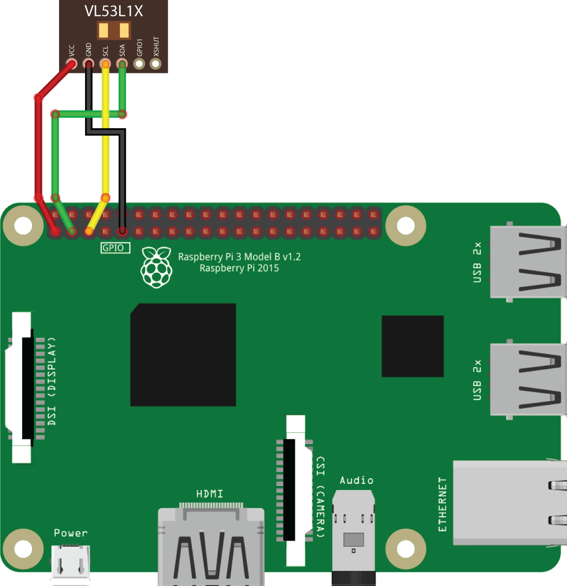

# Работа с лазерным дальномером

## Дальномер VL53L1X

Рекомендуемая модель дальномера – STM VL53L1X. $\color{red}{\textsf{🔴модель}}$

На [образе для Raspberry Pi](image.md) предустановлен соответствующий ROS-драйвер.

### Подключение к Raspberry Pi

Подключите дальномер по интерфейсу I²C к пинам 3V, GND, SCL и SDA:



Если обозначенный пин GND занят, можно использовать другой свободный, используя [распиновку](https://pinout.xyz).

> **Hint** По интерфейсу I²C возможно подключать несколько периферийных устройств одновременно. Используйте для этого параллельное подключение.

### Включение

[Подключитесь по SSH](ssh.md) и отредактируйте файл `~/catkin_ws/src/drone/drone/launch/drone.launch` так, чтобы драйвер VL53L1X был включен:

```xml
<arg name="rangefinder_vl53l1x" default="true"/>
```

По умолчания драйвер дальномера передает данные в Pixhawk (через топик `/rangefinder/range`). Для просмотра данных из топика используйте команду:

```bash
rostopic echo /rangefinder/range
```

### Настройки PX4

> **Hint** Рекомендуется ознакомиться с [прошивкой полетного контроллера](firmware.md).

Для использования данных с дальномера в [PX4 должен быть сконфигурирован](parameters.md).

При использовании EKF2 (`SYS_MC_EST_GROUP` = `ekf2`):

* `EKF2_HGT_MODE` = `2` (Range sensor) – при полете над горизонтальным полом;
* `EKF2_RNG_AID` = `1` (Range aid enabled) – в остальных случаях.

При использовании LPE (`SYS_MC_EST_GROUP` = `local_position_estimator, attitude_estimator_q`):

* В параметре `LPE_FUSION` включен флажок "pub agl as lpos down" – при полете над горизонтальным полом.

### Получение данных из Python

Для получения данных из топика создайте подписчика:

```python
import rospy
from sensor_msgs.msg import Range

rospy.init_node('flight')

def range_callback(msg):
    # Обработка новых данных с дальномера
    print('Rangefinder distance:', msg.range)

rospy.Subscriber('rangefinder/range', Range, range_callback)

rospy.spin() # дальнейший код программы
```

Также существует возможность однократного получения данных с дальномера:

```python
from sensor_msgs.msg import Range

# ...

dist = rospy.wait_for_message('rangefinder/range', Range).range
```

### Визуализация данных

Для построения графика по данным с дальномера может быть использован rqt_multiplot.

Для визуализации данных может быть использован rviz. Для этого необходимо добавить топик типа `sensor_msgs/Range` в визуализацию:


См. [подробнее об rviz и rqt](rviz.md).

<!--
### Подключение к Pixhawk / Pixracer

Поддержка дальномера VL53L1X пока не реализована в прошивке PX4 (по состоянию на версию *1.8.2*).
-->
