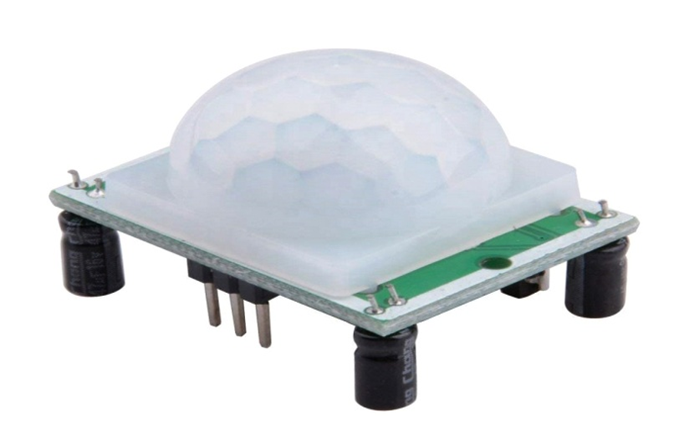
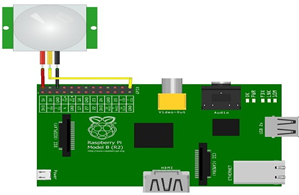

# Инфракрасный индукционный модуль для человеческого тела (датчик движения) (HC-SR501 infrared human body induction module)

HC-SR501 — недорогой датчик PIR, который полностью автономный, способный работать сам по себе или в сопряжении с микроконтроллером. Датчик имеет регулировку чувствительности, которая позволяет определять движение от 3 до 7 метров, а его выход можно настроить так, чтобы он оставался высоким в течение времени от 3 секунд до 5 минут. Так же, датчике имеет встроенный стабилизатор напряжения, поэтому он может питаться от постоянного напряжения от 4,5 до 20 вольт и потребляет небольшое количество тока.

</img>

## Подключение

</img>

## Код

```python
import RPi.GPIO as GPIO                       #Import GPIO library

import time                                   #Import time library

GPIO.setmode(GPIO.BOARD)                      #Set GPIO pin numbering

pir = 26                                      #Associate pin 26 to pir

GPIO.setup(pir, GPIO.IN)                      #Set pin as GPIO in 

print "Waiting for sensor to settle"

time.sleep(2)                   #Waiting 2 seconds for the sensor to initiate

print "Detecting motion"

while True:

if GPIO.input(pir):             #Check whether pir is HIGH

print "Motion Detected!"

time.sleep(2)              #D1- Delay to avoid multiple detection

time.sleep(0.1)  #While loop delay should be less than detection delay
```