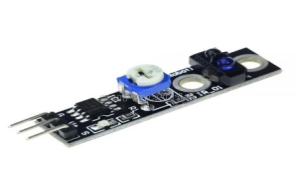
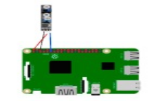

# Модуль трассировки пути

Модуль трассировки пути – переключатель отражения ИК-света, полезный для обхода препятствий или следования по прямой.  Для обхода препятствий вы можете разместить этот модуль перед отправляющими / принимающими диодами, что приведет к вытягиванию выходного штыря на расстояние 1 см.

</img>

## Подключение

</img>

## Код

```python
#!/usr/bin/env python
import RPi.GPIO as GPIO
 
IRTrackingPin = 11
OutLedPin = 12
 
def setup():
GPIO.setmode(GPIO.BOARD) # Set the GPIO pins as numbering
GPIO.setup(OutLedPin, GPIO.OUT) # Set the OutLedPin's mode is output
GPIO.setup(IRTrackingPin, GPIO.IN, pull_up_down=GPIO.PUD_UP)
GPIO.output(OutLedPin, GPIO.HIGH) # Set the OutLedPin high(+3.3V) to off led
 
def loop():
while True:
if GPIO.input(IRTrackingPin) == GPIO.LOW:
 
print '14CORE | IR Tracking Test Code'
print '------------------------------'
print 'The sensor detects white color line'
 
GPIO.output(OutLedPin, GPIO.LOW) # Set the OutLedPin turn HIGH/ON
else:
 
print '14CORE | IR Tracking Test Code'
print '------------------------------'
print 'The sensor detects black color line'
GPIO.output(OutLedPin, GPIO.HIGH) # Set the OutLedPin turn LOW/OFF
 
def destroy():
GPIO.output(OutLedPin, GPIO.HIGH) # Set the OutLedPin turn HIGH
GPIO.cleanup() # Release resource
 
if __name__ == '__main__': # The Program will start from here
setup()
try:
loop()
except KeyboardInterrupt: # When control c is pressed child program destroy() will be executed.
destroy()
```
