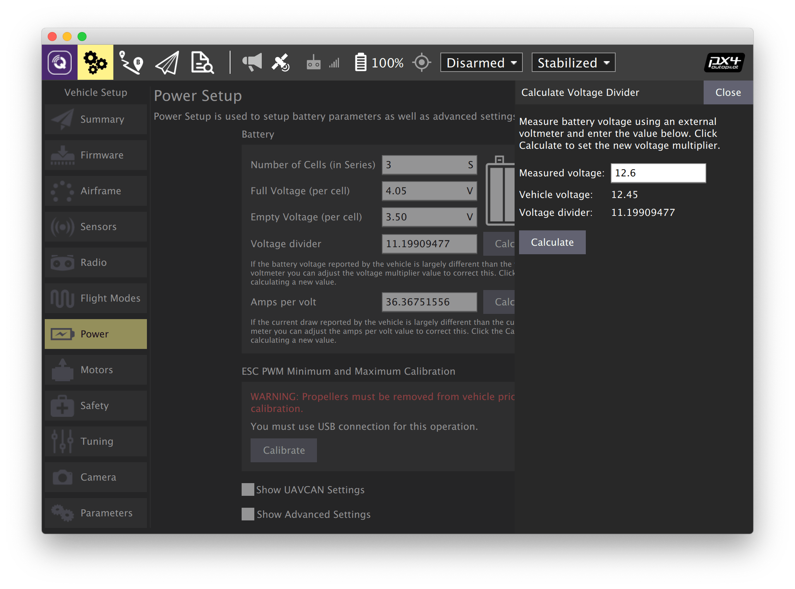
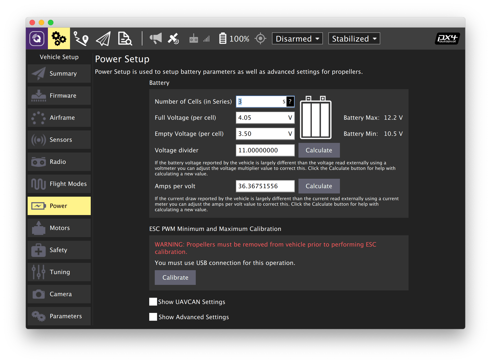

# Настройка питания

Чтобы откалибровать параметры, связанные с электропитанием, зайдите во вкладку *Vehicle Setup* и выберите меню *Power*.

## Калибровка делителя напряжения

> **Note** Калибровка делителя напряжения должна выполняться с подключенным АКБ.

1. В программе QGroundControl перейдите в панель *Vehicle Setup* и выберите меню *Power*.
2. Установите параметр *Number of cells* в соответствии с количеством банок в АКБ (*3S* для Клевера 4) $\color{red}{\textsf{🔴сколько у нас и на какие дроны}}$.
3. Откалибруйте делитель напряжения:
   * Подключите индикатор напряжения к балансировочному разъему АКБ.
   * Нажмите кнопку *Calculate* напротив надписи *Voltage Divider*.
   * Введите в открывшемся поле суммарное значение напряжения с индикатора напряжения.
   * Нажмите *Close*, чтобы сохранить рассчитанное значение.

В случае отсутствия индикатора напряжения или невозможности ручной калибровки, установите усредненное значение делителя напряжения для $\color{red}{\textsf{🔴название дрона}}$ (*Voltage divider* = 11 $\color{red}{\textsf{🔴значение}}$).

Дополнительная информация: https://docs.qgroundcontrol.com/en/SetupView/Power.html.

## Калибровка регуляторов (ESC)

> **Warning** **Никогда не выполняйте калибровку регуляторов с установленными пропеллерами.** В некоторых случаях моторы могут начать вращаться на максимальной скорости.

1. Убедитесь, что АКБ не подключена и пропеллеры сняты
2. Нажмите *Calibrate*.
3. После появлении надписи *Connect the battery now* подсоедините АКБ.
4. Дождитесь появления надписи *Calibration complete*.

Дополнительная информация: https://docs.px4.io/master/en/advanced_config/esc_calibration.html.

**Далее**: [настройка Failsafe](failsafe.md).
