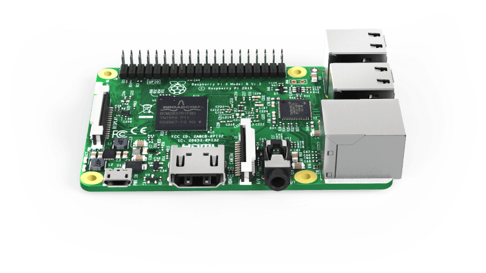

Raspberry Pi
============

**Raspberry Pi** – это свободно помещающийся на ладони одноплатный компьютер, созданный на базе мобильного микропроцессора ARM. Он обладает низким энергопотреблением и может работать даже от солнечных батарей.

Технические характеристики:

* Broadcom BCM2711 SoC;
* 64-битный четырехъядерный ARMv8 Cortex-A72 процессор с тактовой частотой 1.5 ГГц;
* Графический сопроцессор VideoCore VI;
* Память на 1/2/4/8ГБ LPDDR4 SDRAM;
* Gigabit Ethernet;
* USB3.0;
* 2 x micro-HDMI;
* 2.4 ГГц и 5 ГГц IEEE 802.11.b/g/n/ac Wi-Fi + Bluetooth 5.0 Low Energy (BLE).

Более подробную информацию читайте на странице [Raspberry Pi 4 Model B](https://www.raspberrypi.com/products/raspberry-pi-4-model-b/specifications/).

Raspberry Pi подключается к полетному контроллеру и используется как вспомогательный компьютер. Он позволяет [подключаться к дрону по Wi-Fi](wifi.md), программировать автономные полеты, работать с периферией и многое другое.

**Далее**: [образ для Raspberry Pi](image.md).
