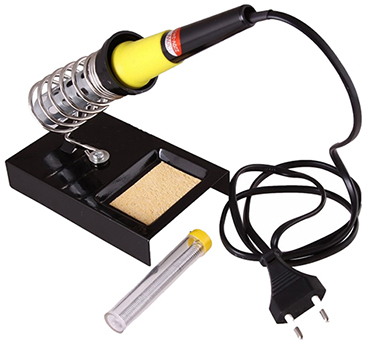
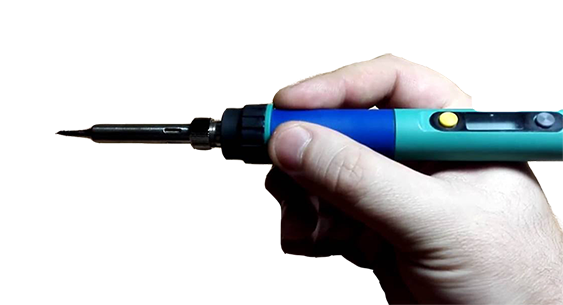
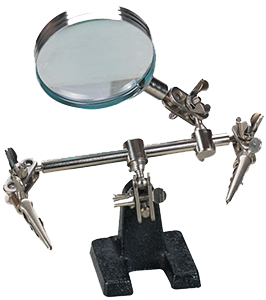
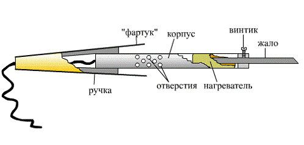

Инструкция по безопасности при сборке
===

Пайка
-----

Работы, связанные с пайкой и лужением, должны проводиться в специально оборудованных и предварительно подготовленных помещениях. Обязательно должна присутствовать система вентиляции.

Перед началом работы необходимо:

1. Привести в порядок рабочее место, ничего не должно мешать процессу. Рабочее место должно быть хорошо освещено.
2. Проверить целостность проводки и штепсельной вилки.
3. Паяльник, находящийся в рабочем состоянии, установить в зоне действия местной вытяжной вентиляции, в специальную подставку.
4. Перед началом работы надеть защитный халат, очки и, при необходимости, перчатки.

Во время пайки:

1. Паяльник следует держать только за ручку, так как жало имеет высокую температуру.

    

2. Жало паяльника нагревается до очень высокой температуры, поэтому, в случае его прикосновения к электрическому проводу в ходе пайки изоляция будет повреждена в считанные мгновения, с последующим коротким замыканием.
3. Для перемещения изделий применять специальные инструменты (пинцеты, клещи или другие инструменты), обеспечивающие безопасность при пайке.
4. Во избежание ожогов расплавленным припоем при распайке не выдергивать резко с большим усилием паяемые провода.
5. При пайке мелких и подвижных изделий пользоваться специальным держателем.

    

6. Паяльник переносить за корпус, а не за провод или рабочую часть. При перерывах в работе паяльник отключать от электросети.

> **Внимание** При обнаружении неисправной работы паяльника или возникновении возгорания отключить его от питающей электросети.

Канифоль и припой при плавлении выделяют значительное количество вредных веществ. Настойчиво советуется проветривать помещение после каждой пайки. Через каждые 30 минут нужно делать небольшие перерывы со сквозным проветриванием помещения и не забывать при этом отключать паяльник.

