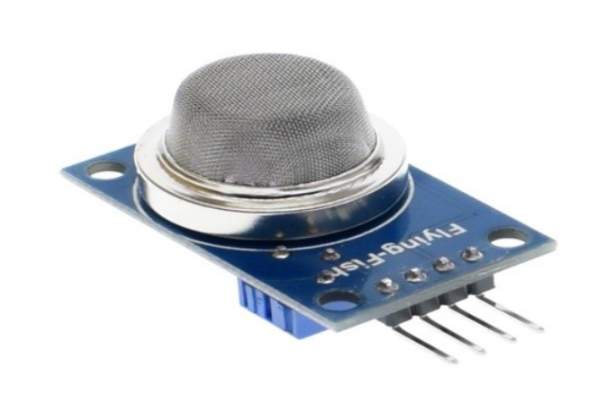
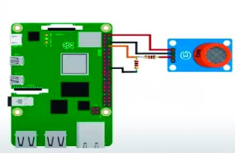

# Датчик газа (MQ-2 gas sensor module)

Датчик газа MQ-2 - это недорогой электронный датчик, используемый для определения концентрации газов в окружающей среде. Газовый датчик MQ-2 используется в системах безопасности для обнаружения потенциально опасных газов или легковоспламеняющегося дыма.

</img>

## Подключение

</img>

## Код

```python
from mq2 import MQ2
import utime

pin=26

sensor = MQ2(pinData = pin, baseVoltage = 3.3)

print("Calibrating")
sensor.calibrate()
print("Calibration completed")
print("Base resistance:{0}".format(sensor._ro))

while True:
	print("Smoke: {:.1f}".format(sensor.readSmoke())+" - ", end="")
	print("LPG: {:.1f}".format(sensor.readLPG())+" - ", end="")
	print("Methane: {:.1f}".format(sensor.readMethane())+" - ", end="")
	print("Hydrogen: {:.1f}".format(sensor.readHydrogen()))
	utime.sleep(0.5)
```
