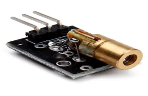
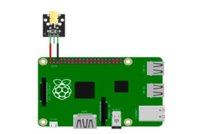

# Датчик лазерный (KY-008 laser head sensor module)

Лазерный датчик используется в качестве лазерного целеуказателя, сигнализации, передатчика азбуки морзе и т.д. Представляет собой плату простой конструкции с установленным на ней небольшим лазерным диодом в коллиматоре с фиксированным фокусным расстоянием и минимальным набором компонентов для управления током диода. Модуль позволяет реализовывать управление лазером с помощью микроконтроллера.

</img>

## Подключение

</img>

## Код

Этот модуль не требует кода для работы.
