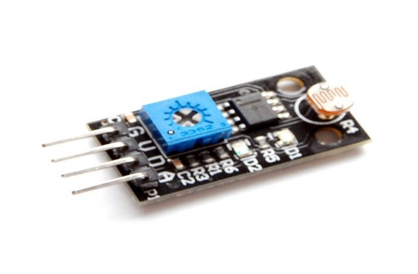
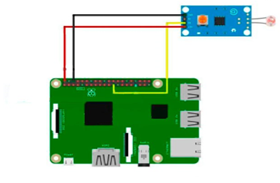

# Светочувствительный датчик сопротивления (Photosensitive resistance sensor module)

Светочувствительный датчик чувствителен к окружающему свету и очень подходит для определения яркости окружающего освещения. Представляет из себя фоторезистор, или светозависимый резистор (LDR), или фотоэлемент, сопротивление которого уменьшается при увеличении интенсивности падающего света; другими словами, он проявляет фотопроводимость.

</img>

## Подключение

</img>

## Код

```python
import RPi.GPIO as GPIO
GPIO.setmode(GPIO.BCM)
GPIO.setup(4,GPIO.IN)
for i in range(0,5):
    print GPIO.input(4)
```
