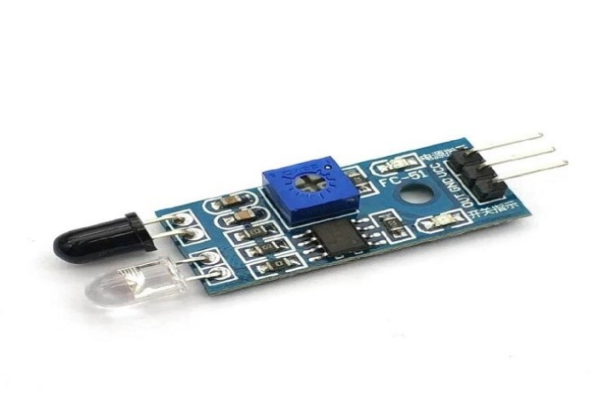
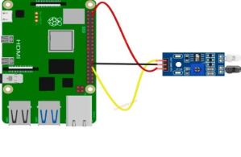

# Датчик обхода препятствий (Obstacle avoidance sensor)

Датчик обхода препятствий (инфракрасный датчик) представляет способен определять определять присутствие препятствий перед ним с помощью инфракрасных сигналов. Дальность обнаружения составляет от 2 см до 30 см, и ее можно регулировать с помощью встроенного потенциометра.

</img>

## Подключение

</img>

## Код

Убедитесь, что библиотека **RPi.GPI** установлена:

```python
sudo apt-get update
sudo apt-get install python3-rpi.gpio
```

```python
import RPi.GPIO as GPIO
import time

# Set the GPIO mode to BCM (Broadcom SOC channel numbering)
GPIO.setmode(GPIO.BCM)

# Set the pin number connected to the ir obstacle avoidance sensor
SENSOR_PIN = 12

# Set the GPIO pin as an input
GPIO.setup(SENSOR_PIN, GPIO.IN)

# Variable to track the ir obstacle avoidance sensor state
prev_obstacle_state = GPIO.HIGH  # Assuming no obstacle initially

try:
    while True:
        obstacle_state = GPIO.input(SENSOR_PIN)

        if obstacle_state != prev_obstacle_state:
            if obstacle_state == GPIO.LOW:
                # obstacle is detected
                print("An obstacle is detected")
            else:
                # An obstacle is removed
                print("An obstacle is removed")

        prev_obstacle_state = obstacle_state
        time.sleep(0.1)  # A small delay to debounce the input
        
except KeyboardInterrupt:
    # Clean up the GPIO settings on program exit
    GPIO.cleanup()
```
