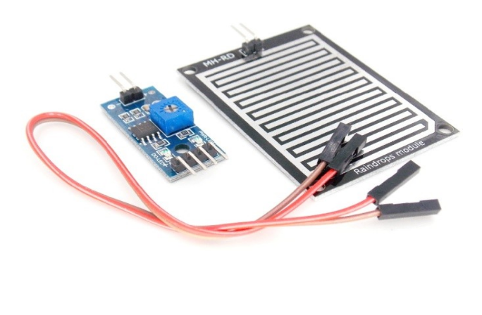
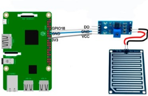

# Датчик дождя (The rain sensor module)

Датчик дождя позволяет определять наличие или отсутствие дождя. Он может быть полезным для отслеживания погодных условий и определения вероятности осадков.

</img>

## Подключение

</img>

## Код

```python
# raindrop sensor DO connected to GPIO18
# HIGH = no rain, LOW = rain detected
# Buzzer on GPIO13
from time import sleep
from gpiozero import Buzzer, InputDevice
 
buzz    = Buzzer(13)
no_rain = InputDevice(18)
 
def buzz_now(iterations):
    for x in range(iterations):
        buzz.on()
        sleep(0.1)
        buzz.off()
        sleep(0.1)
 
while True:
    if not no_rain.is_active:
        print("It's raining!")
        buzz_now(5)
        # insert your other code or functions here
        # e.g. SMS, email, take a photo etc.
    sleep(1)
```
