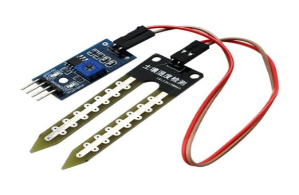
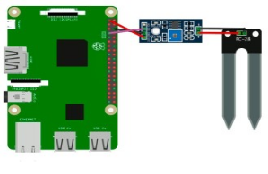

# Датчик влажности почвы (The YL-69 soil moisture sensor)

Датчики влажности почвы измеряют количество воды в почве для поддержания постоянных и идеальных почвенных условий для растений.

</img>

## Подключение

</img>

## Код

```python
from gpiozero import DigitalInputDevice
import time
 
d0_input = DigitalInputDevice(4)
 
while True:
if (not d0_input.value):
    print('Moisture threshold reached!!!')
else:
    print('You need to water your plant')
    time.sleep(2)
```
