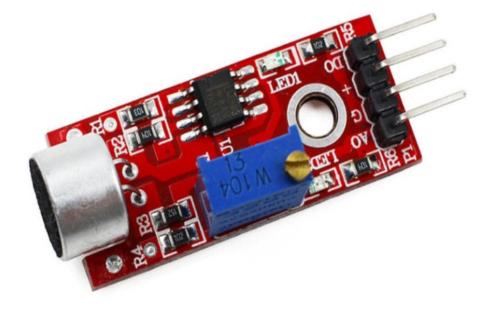
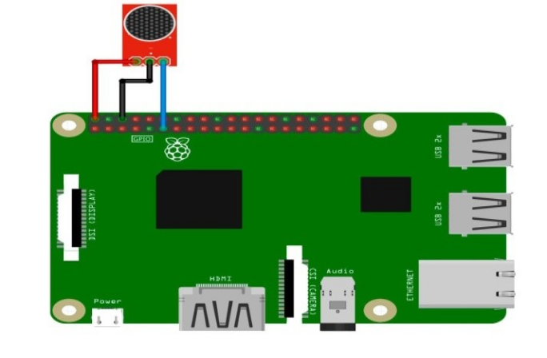

# Датчик звука (Sound sensor module)

Звуковой датчик функционирует как микрофон, который используется для приема звуковых волн. Датчик имеет встроенный конденсаторный электретный микрофон, чувствительный к звуку. Звуковые волны заставляют электретную пленку в микрофоне вибрировать, что приводит к изменению емкости и небольшому напряжению, соответствующему изменению. Затем это напряжение преобразуется в напряжение 0-5 В, которое принимается приемником данных после аналого-цифрового преобразования и передается на микроконтроллер.

</img>

## Подключение

</img>

## Код

```python
#!/usr/bin/python
import RPi.GPIO as GPIO
import time

#GPIO SETUP
channel = 17
GPIO.setmode(GPIO.BCM)
GPIO.setup(channel, GPIO.IN)

def callback(channel):
        if GPIO.input(channel):
                print "Sound Detected!"
        else:
                print "Sound Detected!"

GPIO.add_event_detect(channel, GPIO.BOTH, bouncetime=300)  # let us know when the pin goes HIGH or LOW
GPIO.add_event_callback(channel, callback)  # assign function to GPIO PIN, Run function on change

# infinite loop
while True:
        time.sleep(1)
```
