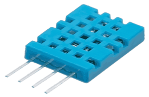
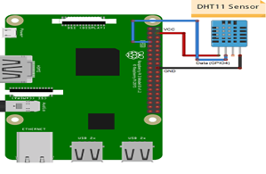

# Датчик температуры и влажности (DH11 temperature and humidity sensor module)

Датчик температуры и влажности DHT11  - это датчик, который обеспечивает цифровые показания температуры и влажности. Его легко настроить, и для передачи данных требуется всего один провод. Эти датчики популярны для использования на удаленных метеостанциях, в системах мониторинга почвы и домашней автоматизации.

</img>

* Датчик DHT11 измеряет и выдает значения влажности и температуры последовательно по одному проводу.
* Он может измерять относительную влажность в процентах (от 20 до 90% относительной влажности) и температуру в градусах Цельсия в диапазоне от 0 до 50 ° C.
* Он имеет 4 контакта, один из которых используется для передачи данных в последовательной форме.
* Импульсы разного уровня громкости и кратности декодируются как логический 1 или логический 0, или как начальный импульс, или как конец кадра.

## Подключение

</img>

## Программирование

### Вывод на SSH-терминал

Будем использовать библиотеку Python Adafruit DHT11. Вы можете загрузить библиотеку с помощью Git, поэтому, если Git еще не установлен на вашем Pi, введите это в командной строке:

```python
sudo apt-get install git-core
```

> **Заметка** Если при установке Git возникает ошибка, запустите **sudo apt-get update** и повторите попытку.

Чтобы установить библиотеку Adafruit DHT11:

Введите это в командной строке, чтобы загрузить библиотеку:

```python
git clone https://github.com/adafruit/Adafruit_Python_DHT.git
```

Измените каталоги с помощью:

```python
cd Adafruit_Python_DHT
```

Теперь введите это:

```python
sudo apt-get install build-essential python-dev
```

Затем установите библиотеку с помощью:

```python
sudo python setup.py install
```

### Код

```python
#!/usr/bin/python
import sys
import Adafruit_DHT

while True:

    humidity, temperature = Adafruit_DHT.read_retry(11, 4)

    print 'Temp: {0:0.1f} C  Humidity: {1:0.1f} %'.format(temperature, humidity)
```

## Вывод на дисплей

Чтобы вывести показания DHT11 на дисплей, нам нужно установить еще одну библиотеку Python под названием RPLCD для управления дисплеем. Чтобы установить библиотеку RPLCD, нам сначала нужно установить индекс пакетов Python или PIP. Проверьте, установлен ли PIP на вашем RPi:

```python
sudo apt-get install python-pip
```

После установки PIP установите библиотеку RPLCD:

```python
sudo pip install RPLCD
```

После установки библиотеки вы можете использовать следующий код для вывода показаний DHT11 на ЖК-дисплей.

### Код

```python
#!/usr/bin/python
import sys
import Adafruit_DHT

from RPLCD import CharLCD

lcd = CharLCD(cols=16, rows=2, pin_rs=37, pin_e=35, pins_data=[33, 31, 29, 23])


while True:
    humidity, temperature = Adafruit_DHT.read_retry(11, 4)

    lcd.cursor_pos = (0, 0)
    lcd.write_string("Temp: %d C" % temperature)
    lcd.cursor_pos = (1, 0)
    lcd.write_string("Humidity: %d %%" % humidity)
```
