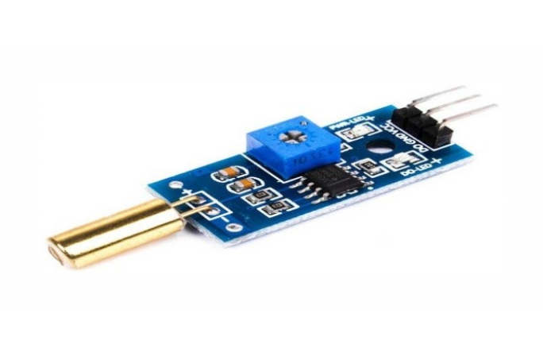
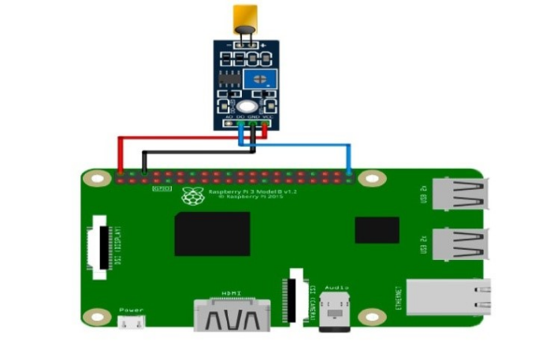

# Датчик наклона (The tilt sensor module)

</img>

## Подключение

</img>

## Код

```python
#!/usr/bin/env python
import RPi.GPIO as GPIO

channel = 21
GPIO.setmode(GPIO.BCM)       
GPIO.setup(channel, GPIO.IN, pull_up_down=GPIO.PUD_UP)

def alert(ev=None):
	print("Tilt Detected")

def loop():
	GPIO.add_event_detect(channel, GPIO.FALLING, callback=alert, bouncetime=100) 
	while True:
		pass   

if __name__ == '__main__':
	try:
		loop()
	except KeyboardInterrupt: 
		GPIO.cleanup()
```
