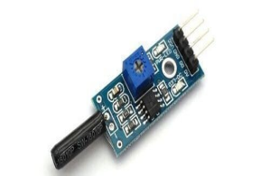
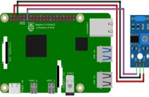

# Датчик вибрации (Vibration sensor module)

Датчик вибрации использовать для обнаружения любого вида вибрации и движения. Датчик может обнаруживать любые вибрации и движение в определенном диапазоне.

</img>

## Подключение

</img>

## Код

```python
#!/usr/bin/python
import RPi.GPIO as GPIO
import time
 
#GPIO SETUP
channel = 17
GPIO.setmode(GPIO.BCM)
GPIO.setup(channel, GPIO.IN)
 
def callback(channel):
        if GPIO.input(channel):
                print "Movement Detected!"
        else:
                print "Movement Detected!"
 
GPIO.add_event_detect(channel, GPIO.BOTH, bouncetime=300)  # let us know when the pin goes HIGH or LOW
GPIO.add_event_callback(channel, callback)  # assign function to GPIO PIN, Run function on change
 
# infinite loop
while True:
        time.sleep(1)
```
