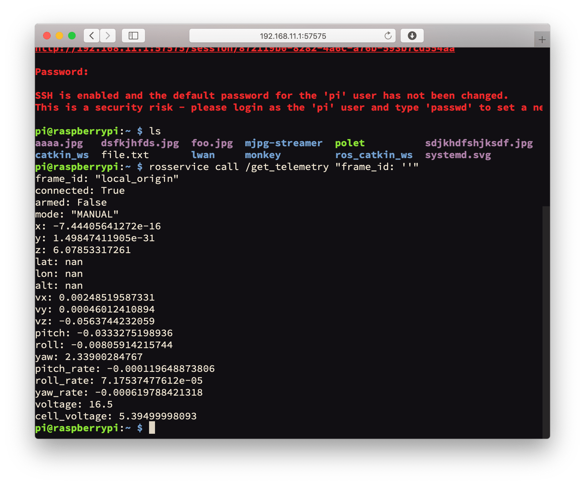

# Доступ по SSH к Raspberry Pi

На [образе для RPi](image.md) преднастроен доступ по SSH для редактирования файлов, загрузки данных и запуска программ.

Для доступа по SSH необходимо [подключиться к Raspberry Pi по Wi-Fi](wifi.md) (также возможно подключение через Ethernet-кабель).

В GNU/Linux или macOS необходимо запустить Терминал и выполнить команду:

```bash
ssh pi@192.168.11.1
```

Пароль: ``raspberry``.

Для доступа по SSH из Windows можно использовать [PuTTY](https://www.chiark.greenend.org.uk/~sgtatham/putty/latest.html) или веб-доступ (см. далее).

Подробнее: https://www.raspberrypi.org/documentation/remote-access/ssh/README.md.

## Веб-доступ

Доступ к шеллу также доступен через веб-браузер (с использованием [Butterfly](https://github.com/paradoxxxzero/butterfly)). Для доступа откройте страницу http://192.168.11.1 и выберите на ней ссылку *Open web terminal*:



**Далее**: [Командная строка](cli.md).
