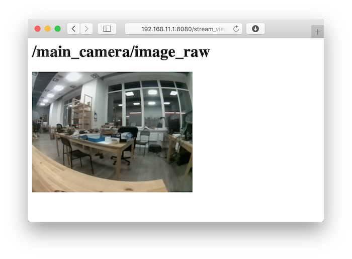

# Просмотр изображений с камер

Для просмотра изображений с камер (или других ROS-топиков) можно смотреть их через браузер, используя web_video_server.

## Просмотр через браузер

Для просмотра видеострима нужно [подключиться к Wi-Fi](wifi.md) **drone-xxxx**, перейти на страницу [http://192.168.11.1:8080/](http://192.168.11.1:8080/) и выбрать топик.

Если передача картинки работает слишком медленно, можно ускорить ее, указав тип передаваемых данных `mjpeg` и меняя GET-параметр `quality` (от 1 до 100), который отвечает за сжатие видеострима, например:

http://192.168.11.1:8080/stream_viewer?topic=/main_camera/image_raw&type=mjpeg&quality=1

По URL выше будет доступен стрим с основной камеры в минимальном возможном качестве.

Также доступны параметры `width`, `height` и другие. Подробнее о `web_video_server`: http://wiki.ros.org/web_video_server.
